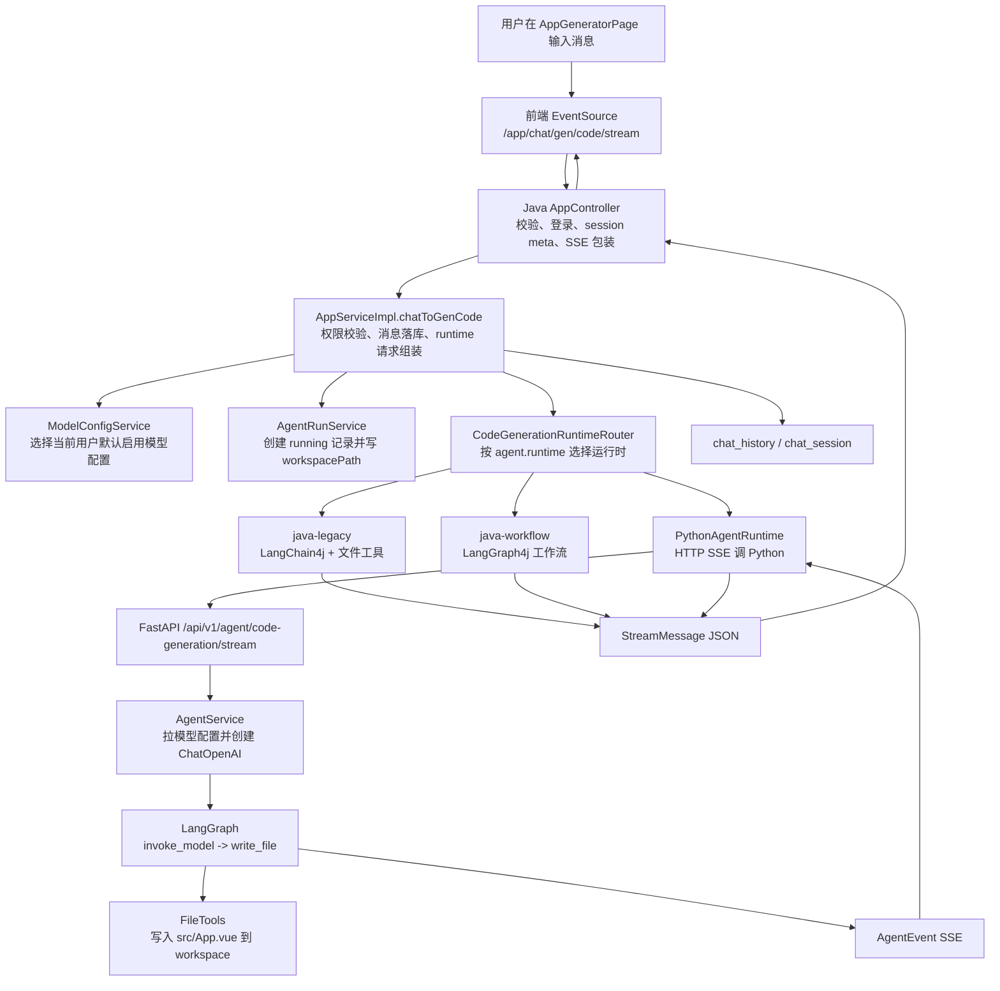

# AI 对话数据流与模型执行链路

本文基于 2026-06-09 当前仓库代码梳理 `ac-ai-code-free` 中一次 AI 对话从前端输入、Java 控制面、Python 执行面、模型调用、工具执行、SSE 回传、消息落库到预览刷新之间的数据流。

## 核心结论

当前项目不是单一路径，而是三套 `CodeGenerationRuntime` 可以被路由选择：

| Runtime | 名称 | 运行位置 | 主要用途 | 当前选择方式 |
| --- | --- | --- | --- | --- |
| Java legacy | `java-legacy` | Java 进程内 | LangChain4j 声明式服务，支持模型自主调用 Java 文件工具 | 默认值来自 `AGENT_RUNTIME`，默认 `java-legacy`，见 [application.yml:150](backend-java/src/main/resources/application.yml) 和 [CodeGenerationRuntimeRouter.java:17](backend-java/src/main/java/com/adcage/acaicodefree/runtime/CodeGenerationRuntimeRouter.java) |
| Java workflow | `java-workflow` | Java 进程内 | LangGraph4j 编排图片收集、prompt 增强、路由、代码生成、质量检查 | 同样由 runtime router 选择，见 [JavaWorkflowRuntime.java:13](backend-java/src/main/java/com/adcage/acaicodefree/runtime/impl/JavaWorkflowRuntime.java) |
| Python agent | `python-agent` | Python FastAPI 服务 | Java 传入 AgentRun、workspace、模型配置版本，Python 用 LangGraph + LangChain OpenAI 执行 | 同样由 runtime router 选择，见 [PythonAgentRuntime.java:27](backend-java/src/main/java/com/adcage/acaicodefree/runtime/impl/PythonAgentRuntime.java) |

整体边界是：Java 负责用户、应用、会话、权限、模型配置选择、AgentRun 记录、SSE 协议兼容和聊天记录落库；Python runtime 负责在独立进程里拉取 Java 模型配置、创建 OpenAI-compatible chat model、运行 LangGraph、写入 agent workspace。

## 总体数据流图



## 一次对话的完整链路

### 1. 前端发起 SSE

前端页面是 [AppGeneratorPage.vue](frontend-vue/src/pages/app/AppGeneratorPage.vue)。用户点击发送时，`doChat` 会准备当前 session、把用户消息先放到本地消息列表，然后调用 `startSSE`，见 [AppGeneratorPage.vue:628](frontend-vue/src/pages/app/AppGeneratorPage.vue)。

`startSSE` 使用浏览器原生 `EventSource`，直接请求：

```text
${VITE_API_BASE_URL}/app/chat/gen/code/stream?appId=...&sessionId=...&message=...
```

对应代码见 [AppGeneratorPage.vue:403](frontend-vue/src/pages/app/AppGeneratorPage.vue) 到 [AppGeneratorPage.vue:421](frontend-vue/src/pages/app/AppGeneratorPage.vue)。这里没有使用生成的 axios API 函数，虽然 `appController.ts` 里也生成了 `chatToGenCode`，见 [appController.ts:44](frontend-vue/src/api/appController.ts)。

前端消费三类 SSE：

- `meta`：读取后端创建或确认的 `sessionId`，见 [AppGeneratorPage.vue:423](frontend-vue/src/pages/app/AppGeneratorPage.vue)。
- `business-error`：显示业务错误并终止生成，见 [AppGeneratorPage.vue:454](frontend-vue/src/pages/app/AppGeneratorPage.vue)。
- `done`：关闭连接并延迟刷新预览，见 [AppGeneratorPage.vue:469](frontend-vue/src/pages/app/AppGeneratorPage.vue)。

普通 message 的格式是后端包出来的 `{ "d": "<chunk>" }`。前端取出 `data.d` 后调用 `appendStreamChunk`，见 [AppGeneratorPage.vue:474](frontend-vue/src/pages/app/AppGeneratorPage.vue) 到 [AppGeneratorPage.vue:491](frontend-vue/src/pages/app/AppGeneratorPage.vue)。

如果 chunk 是结构化工具事件，前端会解析 `type=ai_response/tool_request/tool_executed`，并把工具调用渲染为 `[工具调用]` 和 `[工具完成]` 行，见 [AppGeneratorPage.vue:540](frontend-vue/src/pages/app/AppGeneratorPage.vue) 到 [AppGeneratorPage.vue:567](frontend-vue/src/pages/app/AppGeneratorPage.vue)。工具名到中文文案的转换在 [AppGeneratorPage.vue:581](frontend-vue/src/pages/app/AppGeneratorPage.vue)。

### 2. Java Controller 包装 SSE 协议

后端入口是 `GET /api/app/chat/gen/code/stream`，类上有 `/app`，server context-path 是 `/api`，见 [application.yml:23](backend-java/src/main/resources/application.yml) 和 [AppController.java:55](backend-java/src/main/java/com/adcage/acaicodefree/controller/AppController.java)。

具体方法在 [AppController.java:234](backend-java/src/main/java/com/adcage/acaicodefree/controller/AppController.java) 到 [AppController.java:288](backend-java/src/main/java/com/adcage/acaicodefree/controller/AppController.java)：

1. `@RateLimit` 限制每个用户 60 秒 5 次，见 [AppController.java:234](backend-java/src/main/java/com/adcage/acaicodefree/controller/AppController.java)。
2. 校验 `appId/message`，读取登录用户，见 [AppController.java:240](backend-java/src/main/java/com/adcage/acaicodefree/controller/AppController.java)。
3. 如果没有 `sessionId`，调用 `appService.createChatSession` 自动创建，见 [AppController.java:245](backend-java/src/main/java/com/adcage/acaicodefree/controller/AppController.java)。
4. 调用 `appService.chatToGenCode` 获取 `Flux<String>`，见 [AppController.java:249](backend-java/src/main/java/com/adcage/acaicodefree/controller/AppController.java)。
5. 先返回 `event: meta`，再把每个字符串 chunk 包成 `{d: chunk}`，最后返回 `event: done`，见 [AppController.java:250](backend-java/src/main/java/com/adcage/acaicodefree/controller/AppController.java) 到 [AppController.java:268](backend-java/src/main/java/com/adcage/acaicodefree/controller/AppController.java)。
6. 异常时转换为 `business-error` SSE，见 [AppController.java:269](backend-java/src/main/java/com/adcage/acaicodefree/controller/AppController.java)。

### 3. Java Service 作为控制面

AI 对话的 Java 主控制点是 [AppServiceImpl.chatToGenCode](backend-java/src/main/java/com/adcage/acaicodefree/service/impl/AppServiceImpl.java)。

它做的事情按顺序是：

1. 校验 `appId/sessionId/message`，见 [AppServiceImpl.java:275](backend-java/src/main/java/com/adcage/acaicodefree/service/impl/AppServiceImpl.java)。
2. 校验应用归属和会话归属，见 [AppServiceImpl.java:281](backend-java/src/main/java/com/adcage/acaicodefree/service/impl/AppServiceImpl.java) 和 [AppServiceImpl.java:283](backend-java/src/main/java/com/adcage/acaicodefree/service/impl/AppServiceImpl.java)。
3. 先把用户消息写入 `chat_history`，并更新 session 摘要，见 [AppServiceImpl.java:285](backend-java/src/main/java/com/adcage/acaicodefree/service/impl/AppServiceImpl.java)。
4. 读取应用的 `codeGenType`，转换为 `CodeGenTypeEnum`，见 [AppServiceImpl.java:287](backend-java/src/main/java/com/adcage/acaicodefree/service/impl/AppServiceImpl.java)。
5. 通过 `CodeGenerationRuntimeRouter` 选择 runtime，见 [AppServiceImpl.java:293](backend-java/src/main/java/com/adcage/acaicodefree/service/impl/AppServiceImpl.java)。
6. 根据当前用户取默认启用模型配置，并取出 `modelConfigId/configVersion`，见 [AppServiceImpl.java:295](backend-java/src/main/java/com/adcage/acaicodefree/service/impl/AppServiceImpl.java)。
7. 创建 `AgentRun`，状态初始为 `running`，见 [AppServiceImpl.java:298](backend-java/src/main/java/com/adcage/acaicodefree/service/impl/AppServiceImpl.java) 和 [AgentRunServiceImpl.java:27](backend-java/src/main/java/com/adcage/acaicodefree/service/impl/AgentRunServiceImpl.java)。
8. 生成 workspace 路径 `agent-workspace-dir/{agentRunId}/source` 并写回 `AgentRun`，见 [AppServiceImpl.java:300](backend-java/src/main/java/com/adcage/acaicodefree/service/impl/AppServiceImpl.java)。
9. 构造 `CodeGenerationRequest`，把 `agentRunId/app/session/user/codeGenType/modelConfigId/configVersion/workspacePath` 交给 runtime，见 [AppServiceImpl.java:302](backend-java/src/main/java/com/adcage/acaicodefree/service/impl/AppServiceImpl.java) 到 [AppServiceImpl.java:313](backend-java/src/main/java/com/adcage/acaicodefree/service/impl/AppServiceImpl.java)。
10. 调 runtime 的 `stream` 获取源流，见 [AppServiceImpl.java:317](backend-java/src/main/java/com/adcage/acaicodefree/service/impl/AppServiceImpl.java)。
11. 如果 runtime 是 `java-legacy`，走 `StreamHandlerExecutor` 把结构化事件整理成可读历史；其他 runtime 直接把 chunk 拼进历史缓冲，见 [AppServiceImpl.java:319](backend-java/src/main/java/com/adcage/acaicodefree/service/impl/AppServiceImpl.java)。
12. 流结束后，如果是 Vue 项目模式，会尝试构建 Vue 项目，然后把 AI 消息写入 `chat_history`，见 [AppServiceImpl.java:324](backend-java/src/main/java/com/adcage/acaicodefree/service/impl/AppServiceImpl.java) 到 [AppServiceImpl.java:348](backend-java/src/main/java/com/adcage/acaicodefree/service/impl/AppServiceImpl.java)。
13. 流错误时写入失败消息和错误 extra，见 [AppServiceImpl.java:350](backend-java/src/main/java/com/adcage/acaicodefree/service/impl/AppServiceImpl.java)。

`CodeGenerationRequest` 的字段定义在 [CodeGenerationRequest.java:11](backend-java/src/main/java/com/adcage/acaicodefree/runtime/CodeGenerationRequest.java) 到 [CodeGenerationRequest.java:21](backend-java/src/main/java/com/adcage/acaicodefree/runtime/CodeGenerationRequest.java)。

### 4. Runtime Router 选择执行路径

所有 runtime 都实现同一个接口：`getName()` 和 `Flux<String> stream(CodeGenerationRequest request)`，见 [CodeGenerationRuntime.java:5](backend-java/src/main/java/com/adcage/acaicodefree/runtime/CodeGenerationRuntime.java)。

`CodeGenerationRuntimeRouter` 注入所有 runtime bean，然后用配置项 `agent.runtime` 选择名称匹配的实现，见 [CodeGenerationRuntimeRouter.java:14](backend-java/src/main/java/com/adcage/acaicodefree/runtime/CodeGenerationRuntimeRouter.java) 到 [CodeGenerationRuntimeRouter.java:24](backend-java/src/main/java/com/adcage/acaicodefree/runtime/CodeGenerationRuntimeRouter.java)。

当前 `application.yml` 中配置为：

```yaml
agent:
  runtime: ${AGENT_RUNTIME:java-legacy}
  python:
    base-url: ${AGENT_PYTHON_BASE_URL:http://localhost:9000}
```

来源见 [application.yml:150](backend-java/src/main/resources/application.yml) 到 [application.yml:153](backend-java/src/main/resources/application.yml)。

## Python Agent Runtime 数据流

### 1. Java 调 Python

当 runtime 选中 `python-agent`，Java 会进入 [PythonAgentRuntime.stream](backend-java/src/main/java/com/adcage/acaicodefree/runtime/impl/PythonAgentRuntime.java)。

它通过 Java `HttpClient` 发送 `POST` 请求，并用 `BodyHandlers.ofLines()` 按行读取 Python SSE，见 [PythonAgentRuntime.java:53](backend-java/src/main/java/com/adcage/acaicodefree/runtime/impl/PythonAgentRuntime.java) 到 [PythonAgentRuntime.java:57](backend-java/src/main/java/com/adcage/acaicodefree/runtime/impl/PythonAgentRuntime.java)。

请求 body 字段在 [PythonAgentRuntime.java:83](backend-java/src/main/java/com/adcage/acaicodefree/runtime/impl/PythonAgentRuntime.java) 到 [PythonAgentRuntime.java:97](backend-java/src/main/java/com/adcage/acaicodefree/runtime/impl/PythonAgentRuntime.java)：

| Java body 字段 | 来源 |
| --- | --- |
| `agentRunId` | Java 创建的 AgentRun ID |
| `appId/sessionId/userId` | 当前应用、会话、用户 |
| `prompt` | 用户输入 |
| `codeGenType` | 应用代码生成类型 |
| `workspacePath` | `app.workspace.agent-workspace-dir/{agentRunId}/source` |
| `modelConfigId/configVersion` | Java 选择出的模型配置快照 |

Java 当前拼接的目标路径是 `pythonBaseUrl + "/agent/code-generation/stream"`，见 [PythonAgentRuntime.java:99](backend-java/src/main/java/com/adcage/acaicodefree/runtime/impl/PythonAgentRuntime.java)。

Python 端实际注册路由时带了 `/api/v1` 前缀，见 [router.py:5](agent-runtime-python/app/api/router.py)，业务 router 前缀是 `/agent/code-generation`，见 [code_generation.py:18](agent-runtime-python/app/api/code_generation.py)，所以完整路径是 `POST /api/v1/agent/code-generation/stream`，见 [code_generation.py:33](agent-runtime-python/app/api/code_generation.py) 和测试 [test_code_generation_stream.py:9](agent-runtime-python/tests/api/test_code_generation_stream.py)。

也就是说，如果运行真实 Python 服务，`AGENT_PYTHON_BASE_URL` 需要配置成包含 `/api/v1` 的地址，例如 `http://localhost:9000/api/v1`；否则 Java 默认 `http://localhost:9000` 加 `/agent/...` 会和当前 FastAPI router 不匹配。

### 2. Python 接收请求并转 SSE

FastAPI app 在 [main.py:17](agent-runtime-python/app/main.py) 创建，加入异常处理、中间件和 `api_router`，见 [main.py:20](agent-runtime-python/app/main.py) 到 [main.py:28](agent-runtime-python/app/main.py)。

Python 请求模型是 [CodeGenerationRequest](agent-runtime-python/app/schemas/code_generation.py)，字段与 Java body 对齐，见 [code_generation.py:5](agent-runtime-python/app/schemas/code_generation.py) 到 [code_generation.py:13](agent-runtime-python/app/schemas/code_generation.py)。

`stream_code_generation` 返回 `StreamingResponse`，media type 是 `text/event-stream`，见 [code_generation.py:33](agent-runtime-python/app/api/code_generation.py) 到 [code_generation.py:37](agent-runtime-python/app/api/code_generation.py)。

`event_stream` 遍历 `agent_service.stream(request)` 并用 `format_sse` 包装事件，见 [code_generation.py:26](agent-runtime-python/app/api/code_generation.py) 到 [code_generation.py:30](agent-runtime-python/app/api/code_generation.py)。SSE 格式是：

```text
event: {event.eventType}
data: {AgentEvent JSON}
```

格式化函数见 [sse.py:6](agent-runtime-python/app/core/sse.py)。事件结构是 `agentRunId/seq/eventType/data`，见 [agent_event.py:4](agent-runtime-python/app/events/agent_event.py)。

### 3. Python 拉取 Java 模型配置

Python 的 `AgentService` 初始化时持有 `ModelConfigClient`、`ChatModelFactory`、`PromptBuilder` 和编译好的 LangGraph，见 [agent_service.py:13](agent-runtime-python/app/services/agent_service.py) 到 [agent_service.py:23](agent-runtime-python/app/services/agent_service.py)。

如果请求里有 `modelConfigId`，Python 调 `ModelConfigClient.get_runtime_config(modelConfigId, configVersion)`，见 [agent_service.py:25](agent-runtime-python/app/services/agent_service.py) 到 [agent_service.py:32](agent-runtime-python/app/services/agent_service.py)。

`ModelConfigClient` 调 Java：

```text
GET {JAVA_PLATFORM_BASE_URL}/model-config/internal/runtime?id=...&configVersion=...
Header: X-Internal-Secret: ...
```

代码见 [model_config_client.py:17](agent-runtime-python/app/services/model_config_client.py) 到 [model_config_client.py:30](agent-runtime-python/app/services/model_config_client.py)。Python 默认 Java base URL 是 `http://localhost:8700/api`，见 [config.py:12](agent-runtime-python/app/core/config.py)。

Java internal endpoint 在 [ModelConfigController.java:148](backend-java/src/main/java/com/adcage/acaicodefree/controller/ModelConfigController.java) 到 [ModelConfigController.java:166](backend-java/src/main/java/com/adcage/acaicodefree/controller/ModelConfigController.java)：

1. 如果配置了 internal secret，则校验 `X-Internal-Secret`，见 [ModelConfigController.java:152](backend-java/src/main/java/com/adcage/acaicodefree/controller/ModelConfigController.java)。
2. 校验配置存在、启用、版本匹配，见 [ModelConfigController.java:155](backend-java/src/main/java/com/adcage/acaicodefree/controller/ModelConfigController.java) 到 [ModelConfigController.java:159](backend-java/src/main/java/com/adcage/acaicodefree/controller/ModelConfigController.java)。
3. 返回 `provider/modelName/baseUrl/apiKey`，其中 `apiKey` 当前直接来自 `apiKeyCipher` 字段，见 [ModelConfigController.java:160](backend-java/src/main/java/com/adcage/acaicodefree/controller/ModelConfigController.java) 到 [ModelConfigController.java:165](backend-java/src/main/java/com/adcage/acaicodefree/controller/ModelConfigController.java)。

Java 选择默认模型配置的规则是：优先当前用户 `enabled=1 && isDefault=1`，没有默认就取最近更新的启用配置，见 [ModelConfigServiceImpl.java:72](backend-java/src/main/java/com/adcage/acaicodefree/service/impl/ModelConfigServiceImpl.java) 到 [ModelConfigServiceImpl.java:87](backend-java/src/main/java/com/adcage/acaicodefree/service/impl/ModelConfigServiceImpl.java)。配置版本在编辑后递增，见 [ModelConfigController.java:91](backend-java/src/main/java/com/adcage/acaicodefree/controller/ModelConfigController.java) 到 [ModelConfigController.java:94](backend-java/src/main/java/com/adcage/acaicodefree/controller/ModelConfigController.java) 和 [ModelConfigServiceImpl.java:60](backend-java/src/main/java/com/adcage/acaicodefree/service/impl/ModelConfigServiceImpl.java)。

`model_config` 表保存 provider、modelName、baseUrl、apiKeyCipher、temperature、maxTokens、configVersion、enabled、isDefault，见 [create_table.sql:96](sql/create_table.sql) 到 [create_table.sql:115](sql/create_table.sql)。实体字段见 [ModelConfig.java:31](backend-java/src/main/java/com/adcage/acaicodefree/model/entity/ModelConfig.java) 到 [ModelConfig.java:61](backend-java/src/main/java/com/adcage/acaicodefree/model/entity/ModelConfig.java)。

### 4. Python 创建模型客户端

Python 的 `ChatModelFactory` 只支持 `openai` 和 `openai-compatible` provider，见 [chat_model_factory.py:6](agent-runtime-python/app/services/chat_model_factory.py)。

它要求 `modelName` 和 `apiKey` 非空，并把 `baseUrl` 透传给 `langchain_openai.ChatOpenAI`，见 [chat_model_factory.py:10](agent-runtime-python/app/services/chat_model_factory.py) 到 [chat_model_factory.py:35](agent-runtime-python/app/services/chat_model_factory.py)。

依赖来自 Python `pyproject.toml`，包括 FastAPI、LangGraph、LangChain Core、LangChain OpenAI，见 [pyproject.toml:6](agent-runtime-python/pyproject.toml) 到 [pyproject.toml:16](agent-runtime-python/pyproject.toml)。

### 5. Python LangGraph 执行

Python 当前 LangGraph 在 [graph.py](agent-runtime-python/app/agent/graph.py)，状态字段见 [state.py:9](agent-runtime-python/app/agent/state.py) 到 [state.py:15](agent-runtime-python/app/agent/state.py)。

`AgentService.stream` 的流程是：

1. 先 yield `agent_start` 事件，见 [agent_service.py:34](agent-runtime-python/app/services/agent_service.py) 到 [agent_service.py:36](agent-runtime-python/app/services/agent_service.py)。
2. 拉模型配置并创建 chat model，见 [agent_service.py:37](agent-runtime-python/app/services/agent_service.py)。
3. 调用 `self.graph.ainvoke(...)`，把 request、events、model_config、chat_model 放进状态，见 [agent_service.py:38](agent-runtime-python/app/services/agent_service.py) 到 [agent_service.py:45](agent-runtime-python/app/services/agent_service.py)。
4. graph 执行后，把 start 之后的事件逐个 yield，见 [agent_service.py:46](agent-runtime-python/app/services/agent_service.py)。

Graph 结构只有两个节点：`invoke_model -> write_file -> END`，见 [graph.py:115](agent-runtime-python/app/agent/graph.py) 到 [graph.py:122](agent-runtime-python/app/agent/graph.py)。

`invoke_model`：

- 如果没有 chat model，走降级模板 `_FALLBACK_CONTENT`，并发出 `ai_response` 说明是 fallback，见 [graph.py:32](agent-runtime-python/app/agent/graph.py) 到 [graph.py:41](agent-runtime-python/app/agent/graph.py)。
- 如果有 chat model，用 `PromptBuilder.build_vue_app_prompt` 生成系统 prompt，见 [graph.py:43](agent-runtime-python/app/agent/graph.py) 和 [prompt_builder.py:2](agent-runtime-python/app/services/prompt_builder.py)。
- 调模型时传 `SystemMessage` 和 `HumanMessage`，见 [graph.py:44](agent-runtime-python/app/agent/graph.py) 到 [graph.py:47](agent-runtime-python/app/agent/graph.py)。
- 去掉 markdown 代码围栏，空内容则发 error，见 [graph.py:48](agent-runtime-python/app/agent/graph.py) 到 [graph.py:59](agent-runtime-python/app/agent/graph.py)。
- 成功后发 `ai_response`，内容是“已生成 Vue 页面源码，准备写入 src/App.vue”，见 [graph.py:61](agent-runtime-python/app/agent/graph.py) 到 [graph.py:64](agent-runtime-python/app/agent/graph.py)。

`write_file`：

- 以 `request.workspacePath` 为根目录创建 `Workspace`，没有传则用 `storage/agent-workspaces/{agentRunId}/source`，见 [graph.py:90](agent-runtime-python/app/agent/graph.py)。
- 当前固定写入 `src/App.vue`，见 [graph.py:92](agent-runtime-python/app/agent/graph.py)。
- 写入前发 `tool_request`，写入后发 `tool_executed`，最后发 `done`，见 [graph.py:94](agent-runtime-python/app/agent/graph.py) 到 [graph.py:107](agent-runtime-python/app/agent/graph.py)。

Python `FileTools` 提供 `read_file/write_file/modify_file/delete_file/read_dir`，见 [file_tools.py:8](agent-runtime-python/app/tools/file_tools.py) 到 [file_tools.py:47](agent-runtime-python/app/tools/file_tools.py)。但当前 graph 只调用 `write_file`。它不是把这些工具绑定给模型自主选择，而是 graph 在模型返回后确定性调用写文件工具。

路径安全由 `Workspace.resolve` 保证：空路径报错，解析后的路径不能逃出 workspace 根目录，见 [workspace.py:10](agent-runtime-python/app/tools/workspace.py) 到 [workspace.py:15](agent-runtime-python/app/tools/workspace.py)。

## Python 事件如何回到前端

Python 发出的 SSE 中，Java 当前只过滤 `data:` 行并解析 JSON，见 [PythonAgentRuntime.java:62](backend-java/src/main/java/com/adcage/acaicodefree/runtime/impl/PythonAgentRuntime.java) 到 [PythonAgentRuntime.java:69](backend-java/src/main/java/com/adcage/acaicodefree/runtime/impl/PythonAgentRuntime.java)。也就是说，SSE 的 `event:` 行对 Java 映射不是关键，真正关键的是 `data` JSON 里的 `eventType`。

`PythonAgentEventMapper` 把 Python 事件转成前端已认识的 Java `StreamMessage` JSON，见 [PythonAgentEventMapper.java:14](backend-java/src/main/java/com/adcage/acaicodefree/runtime/PythonAgentEventMapper.java) 到 [PythonAgentEventMapper.java:36](backend-java/src/main/java/com/adcage/acaicodefree/runtime/PythonAgentEventMapper.java)：

| Python `eventType` | Java 输出给前端的消息 |
| --- | --- |
| `ai_response` | `AiResponseMessage(type="ai_response", data=text)` |
| `tool_request` | `ToolRequestMessage(type="tool_request", id, name, arguments)` |
| `tool_executed` | `ToolExecutedMessage(type="tool_executed", id, name, arguments, result)` |
| `error` | `AiResponseMessage("生成失败：...")` |
| `done` | `AiResponseMessage("completed")` 或对应 message |
| 其他 | `AiResponseMessage(String.valueOf(data))` |

Java 的 message 类型定义在：

- [StreamMessage.java:10](backend-java/src/main/java/com/adcage/acaicodefree/ai/model/message/StreamMessage.java)
- [AiResponseMessage.java:10](backend-java/src/main/java/com/adcage/acaicodefree/ai/model/message/AiResponseMessage.java)
- [ToolRequestMessage.java:10](backend-java/src/main/java/com/adcage/acaicodefree/ai/model/message/ToolRequestMessage.java)
- [ToolExecutedMessage.java:10](backend-java/src/main/java/com/adcage/acaicodefree/ai/model/message/ToolExecutedMessage.java)
- [StreamMessageTypeEnum.java:3](backend-java/src/main/java/com/adcage/acaicodefree/ai/model/message/StreamMessageTypeEnum.java)

这些消息最后又被 `AppController` 包成 `{d: chunk}` 发给前端，见 [AppController.java:260](backend-java/src/main/java/com/adcage/acaicodefree/controller/AppController.java)。

## Java Legacy Runtime 数据流

当 runtime 是 `java-legacy`，`JavaLegacyRuntime.stream` 直接调用 `AiCodeGeneratorFacade.generateAndSaveCodeStream(message, codeGenType, appId)`，见 [JavaLegacyRuntime.java:23](backend-java/src/main/java/com/adcage/acaicodefree/runtime/impl/JavaLegacyRuntime.java) 到 [JavaLegacyRuntime.java:29](backend-java/src/main/java/com/adcage/acaicodefree/runtime/impl/JavaLegacyRuntime.java)。

### LangChain4j 声明式服务

`AiCodeGeneratorService` 是 LangChain4j 声明式接口，按单文件、多文件、Vue 项目分别绑定 system prompt，并支持生成和修改两套方法，见 [AiCodeGeneratorService.java:17](backend-java/src/main/java/com/adcage/acaicodefree/ai/AiCodeGeneratorService.java)。

关键方法：

- 单文件流式生成：`generateSingleFileCodeStream`，见 [AiCodeGeneratorService.java:42](backend-java/src/main/java/com/adcage/acaicodefree/ai/AiCodeGeneratorService.java)。
- 多文件流式生成：`generateMultiFileCodeStream`，见 [AiCodeGeneratorService.java:62](backend-java/src/main/java/com/adcage/acaicodefree/ai/AiCodeGeneratorService.java)。
- Vue 工程流式生成：`generateVueProjectCodeStream`，见 [AiCodeGeneratorService.java:82](backend-java/src/main/java/com/adcage/acaicodefree/ai/AiCodeGeneratorService.java)。
- Vue 工程修改：`modifyVueProjectCodeStream`，见 [AiCodeGeneratorService.java:92](backend-java/src/main/java/com/adcage/acaicodefree/ai/AiCodeGeneratorService.java)。

`AiCodeGenServiceFactory` 负责创建服务实例：

- 按 `appId:codeGenType` 做 Caffeine 缓存，见 [AiCodeGenServiceFactory.java:51](backend-java/src/main/java/com/adcage/acaicodefree/ai/AiCodeGenServiceFactory.java) 和 [AiCodeGenServiceFactory.java:57](backend-java/src/main/java/com/adcage/acaicodefree/ai/AiCodeGenServiceFactory.java)。
- Vue 项目使用 `reasoningStreamingChatModel`，其他使用 `openAiStreamingChatModel`，见 [AiCodeGenServiceFactory.java:66](backend-java/src/main/java/com/adcage/acaicodefree/ai/AiCodeGenServiceFactory.java) 到 [AiCodeGenServiceFactory.java:72](backend-java/src/main/java/com/adcage/acaicodefree/ai/AiCodeGenServiceFactory.java)。
- 把 `ToolManager.getAllTools()` 注入 LangChain4j `AiServices`，见 [AiCodeGenServiceFactory.java:78](backend-java/src/main/java/com/adcage/acaicodefree/ai/AiCodeGenServiceFactory.java) 到 [AiCodeGenServiceFactory.java:86](backend-java/src/main/java/com/adcage/acaicodefree/ai/AiCodeGenServiceFactory.java)。
- 用 `ChatMemoryLoader` 按 app 加载历史窗口，见 [AiCodeGenServiceFactory.java:93](backend-java/src/main/java/com/adcage/acaicodefree/ai/AiCodeGenServiceFactory.java) 到 [AiCodeGenServiceFactory.java:107](backend-java/src/main/java/com/adcage/acaicodefree/ai/AiCodeGenServiceFactory.java)。

Java 侧模型配置有两类：

- legacy 通用 OpenAI streaming 配置来自 `langchain4j.open-ai.streaming-chat-model`，见 [application.yml:54](backend-java/src/main/resources/application.yml) 到 [application.yml:71](backend-java/src/main/resources/application.yml)。
- Vue project reasoning 模型配置来自 `app.ai.vue-project`，见 [application.yml:93](backend-java/src/main/resources/application.yml) 到 [application.yml:102](backend-java/src/main/resources/application.yml)，实际 bean 在 [ReasoningStreamingChatModelConfig.java:42](backend-java/src/main/java/com/adcage/acaicodefree/config/ReasoningStreamingChatModelConfig.java) 到 [ReasoningStreamingChatModelConfig.java:53](backend-java/src/main/java/com/adcage/acaicodefree/config/ReasoningStreamingChatModelConfig.java)。

### Java Legacy 文件工具

`ToolManager` 收集所有 `BaseTool` bean，并按工具名注册，见 [ToolManager.java:14](backend-java/src/main/java/com/adcage/acaicodefree/ai/tools/ToolManager.java) 到 [ToolManager.java:44](backend-java/src/main/java/com/adcage/acaicodefree/ai/tools/ToolManager.java)。

所有文件工具继承 `BaseTool`。路径安全逻辑在 `resolveRelativePath`：禁止空路径、绝对路径、逃逸项目根目录，见 [BaseTool.java:87](backend-java/src/main/java/com/adcage/acaicodefree/ai/tools/BaseTool.java) 到 [BaseTool.java:100](backend-java/src/main/java/com/adcage/acaicodefree/ai/tools/BaseTool.java)。项目根目录按 `codeGenType` 定位到 `temp/code_output/{prefix}{appId}`，见 [BaseTool.java:60](backend-java/src/main/java/com/adcage/acaicodefree/ai/tools/BaseTool.java) 到 [BaseTool.java:72](backend-java/src/main/java/com/adcage/acaicodefree/ai/tools/BaseTool.java)。

| 工具 | Java 方法 | 能力 | 行号 |
| --- | --- | --- | --- |
| `writeFile` | `FileWriteTool.writeFile` | 写入文件，自动创建父目录 | [FileWriteTool.java:48](backend-java/src/main/java/com/adcage/acaicodefree/ai/tools/FileWriteTool.java) |
| `readFile` | `FileReadTool.readFile` | 读取指定文件内容 | [FileReadTool.java:48](backend-java/src/main/java/com/adcage/acaicodefree/ai/tools/FileReadTool.java) |
| `modifyFile` | `FileModifyTool.modifyFile` | 按字符串替换文件内容 | [FileModifyTool.java:56](backend-java/src/main/java/com/adcage/acaicodefree/ai/tools/FileModifyTool.java) |
| `deleteFile` | `FileDeleteTool.deleteFile` | 删除文件，保护关键文件 | [FileDeleteTool.java:68](backend-java/src/main/java/com/adcage/acaicodefree/ai/tools/FileDeleteTool.java) |
| `readDir` | `FileDirReadTool.readDir` | 读取目录树，深度和数量有限制 | [FileDirReadTool.java:54](backend-java/src/main/java/com/adcage/acaicodefree/ai/tools/FileDirReadTool.java) |

删除保护规则包括 `package.json`、`vite.config.*`、`tsconfig.json`、锁文件、`src/main.*`、`src/app.vue` 等，见 [FileDeleteTool.java:20](backend-java/src/main/java/com/adcage/acaicodefree/ai/tools/FileDeleteTool.java) 到 [FileDeleteTool.java:38](backend-java/src/main/java/com/adcage/acaicodefree/ai/tools/FileDeleteTool.java)。

### Java Legacy 流式事件

`AiCodeGeneratorFacade` 按 `codeGenType` 选择具体 LangChain4j 方法，见 [AiCodeGeneratorFacade.java:75](backend-java/src/main/java/com/adcage/acaicodefree/core/AiCodeGeneratorFacade.java) 到 [AiCodeGeneratorFacade.java:85](backend-java/src/main/java/com/adcage/acaicodefree/core/AiCodeGeneratorFacade.java)。

Token 到前端消息的转换：

- 普通 token 包成 `AiResponseMessage`，见 [AiCodeGeneratorFacade.java:168](backend-java/src/main/java/com/adcage/acaicodefree/core/AiCodeGeneratorFacade.java) 到 [AiCodeGeneratorFacade.java:173](backend-java/src/main/java/com/adcage/acaicodefree/core/AiCodeGeneratorFacade.java)。
- LangChain4j 的 `onToolExecuted` 会连续发 `ToolRequestMessage` 和 `ToolExecutedMessage`，见 [AiCodeGeneratorFacade.java:175](backend-java/src/main/java/com/adcage/acaicodefree/core/AiCodeGeneratorFacade.java) 到 [AiCodeGeneratorFacade.java:184](backend-java/src/main/java/com/adcage/acaicodefree/core/AiCodeGeneratorFacade.java)。

只有 `java-legacy` 会额外走 `StreamHandlerExecutor`，见 [AppServiceImpl.java:319](backend-java/src/main/java/com/adcage/acaicodefree/service/impl/AppServiceImpl.java)。`JsonMessageStreamHandler` 会把结构化工具事件转成聊天历史里的可读文本，同时仍把原 chunk 发给前端，见 [JsonMessageStreamHandler.java:22](backend-java/src/main/java/com/adcage/acaicodefree/core/handler/JsonMessageStreamHandler.java) 到 [JsonMessageStreamHandler.java:66](backend-java/src/main/java/com/adcage/acaicodefree/core/handler/JsonMessageStreamHandler.java)。

## Java Workflow Runtime 数据流

当 runtime 是 `java-workflow`，`JavaWorkflowRuntime.stream` 调 `workflowCodeGeneratorService.executeWorkflowWithFlux(appId, message)`，见 [JavaWorkflowRuntime.java:23](backend-java/src/main/java/com/adcage/acaicodefree/runtime/impl/JavaWorkflowRuntime.java) 到 [JavaWorkflowRuntime.java:26](backend-java/src/main/java/com/adcage/acaicodefree/runtime/impl/JavaWorkflowRuntime.java)。

`WorkflowCodeGeneratorService` 组装工作流，普通模式节点是：

1. `ImageCollectorNode`
2. `PromptEnhancerNode`
3. `RouterNode`
4. `CodeGeneratorNode`
5. `CodeQualityCheckNode`
6. `ProjectBuilderNode`

组装代码见 [WorkflowCodeGeneratorService.java:61](backend-java/src/main/java/com/adcage/acaicodefree/workflow/service/WorkflowCodeGeneratorService.java) 到 [WorkflowCodeGeneratorService.java:73](backend-java/src/main/java/com/adcage/acaicodefree/workflow/service/WorkflowCodeGeneratorService.java)，LangGraph4j 图结构见 [CodeGenWorkflow.java:53](backend-java/src/main/java/com/adcage/acaicodefree/workflow/service/CodeGenWorkflow.java) 到 [CodeGenWorkflow.java:77](backend-java/src/main/java/com/adcage/acaicodefree/workflow/service/CodeGenWorkflow.java)。

workflow 状态对象是 `WorkflowContext`，包含 appId、原始 prompt、图片列表、增强 prompt、生成类型、生成目录、构建目录、质量结果等，见 [WorkflowContext.java:30](backend-java/src/main/java/com/adcage/acaicodefree/workflow/state/WorkflowContext.java) 到 [WorkflowContext.java:57](backend-java/src/main/java/com/adcage/acaicodefree/workflow/state/WorkflowContext.java)。

workflow 节点职责：

- `ImageCollectorNode` 调图片收集服务或并行素材工具，失败时降级为空图片列表，见 [ImageCollectorNode.java:67](backend-java/src/main/java/com/adcage/acaicodefree/workflow/node/ImageCollectorNode.java) 到 [ImageCollectorNode.java:85](backend-java/src/main/java/com/adcage/acaicodefree/workflow/node/ImageCollectorNode.java)。
- `PromptEnhancerNode` 调 prompt 增强服务，失败时拼 fallback prompt，见 [PromptEnhancerNode.java:24](backend-java/src/main/java/com/adcage/acaicodefree/workflow/node/PromptEnhancerNode.java) 到 [PromptEnhancerNode.java:39](backend-java/src/main/java/com/adcage/acaicodefree/workflow/node/PromptEnhancerNode.java)。
- `RouterNode` 目前用规则判断单文件或多文件，不是调模型路由，见 [RouterNode.java:16](backend-java/src/main/java/com/adcage/acaicodefree/workflow/node/RouterNode.java) 到 [RouterNode.java:26](backend-java/src/main/java/com/adcage/acaicodefree/workflow/node/RouterNode.java)。
- `CodeGeneratorNode` 最终仍调用 `AiCodeGeneratorFacade.generateAndSaveCode`，见 [CodeGeneratorNode.java:41](backend-java/src/main/java/com/adcage/acaicodefree/workflow/node/CodeGeneratorNode.java) 到 [CodeGeneratorNode.java:44](backend-java/src/main/java/com/adcage/acaicodefree/workflow/node/CodeGeneratorNode.java)。
- `CodeQualityCheckNode` 检查生成目录和必要文件，并决定 retry、skip build 或 build，见 [CodeQualityCheckNode.java:25](backend-java/src/main/java/com/adcage/acaicodefree/workflow/node/CodeQualityCheckNode.java) 到 [CodeQualityCheckNode.java:42](backend-java/src/main/java/com/adcage/acaicodefree/workflow/node/CodeQualityCheckNode.java)。
- `ProjectBuilderNode` 当前是 stub，只写入 `[stub] /build/{appId}`，见 [ProjectBuilderNode.java:12](backend-java/src/main/java/com/adcage/acaicodefree/workflow/node/ProjectBuilderNode.java) 到 [ProjectBuilderNode.java:18](backend-java/src/main/java/com/adcage/acaicodefree/workflow/node/ProjectBuilderNode.java)。

workflow 的素材工具包括 Pexels 图片搜索、unDraw 插画、Mermaid 图渲染、DashScope Logo 生成，配置 bean 在 [WorkflowToolConfig.java:36](backend-java/src/main/java/com/adcage/acaicodefree/workflow/config/WorkflowToolConfig.java) 到 [WorkflowToolConfig.java:98](backend-java/src/main/java/com/adcage/acaicodefree/workflow/config/WorkflowToolConfig.java)。这些工具通过 `ImageCollectionServiceFactory` 注入 LangChain4j 图片收集服务，见 [ImageCollectionServiceFactory.java:30](backend-java/src/main/java/com/adcage/acaicodefree/workflow/ai/ImageCollectionServiceFactory.java) 到 [ImageCollectionServiceFactory.java:34](backend-java/src/main/java/com/adcage/acaicodefree/workflow/ai/ImageCollectionServiceFactory.java)。

## 应用创建时的模型路由

应用创建阶段还有一个独立的 AI 路由：如果请求没有指定 `codeGenType`，`AppServiceImpl.resolveCodeGenType` 会调用 `AiCodeGenTypeRoutingService` 判断单文件、多文件或 Vue 项目，见 [AppServiceImpl.java:573](backend-java/src/main/java/com/adcage/acaicodefree/service/impl/AppServiceImpl.java) 到 [AppServiceImpl.java:592](backend-java/src/main/java/com/adcage/acaicodefree/service/impl/AppServiceImpl.java)。

`AiCodeGenTypeRoutingService` 使用 `prompt/codegen-routing-system-prompt.txt`，见 [AiCodeGenTypeRoutingService.java:8](backend-java/src/main/java/com/adcage/acaicodefree/ai/AiCodeGenTypeRoutingService.java)。服务由 `routingChatModel` 创建，见 [AiCodeGenTypeRoutingServiceFactory.java:14](backend-java/src/main/java/com/adcage/acaicodefree/ai/AiCodeGenTypeRoutingServiceFactory.java) 到 [AiCodeGenTypeRoutingServiceFactory.java:17](backend-java/src/main/java/com/adcage/acaicodefree/ai/AiCodeGenTypeRoutingServiceFactory.java)。`routingChatModel` 的配置在 [RoutingChatModelConfig.java:30](backend-java/src/main/java/com/adcage/acaicodefree/config/ai/RoutingChatModelConfig.java) 到 [RoutingChatModelConfig.java:41](backend-java/src/main/java/com/adcage/acaicodefree/config/ai/RoutingChatModelConfig.java)。

这一步决定应用的 `codeGenType`，后续对话只读取应用上保存的类型，不会每次重新路由。

## 聊天记录、AgentRun 和表结构

### 聊天会话

`createChatSession` 会生成 `新会话 N`，并写入 `chat_session`，见 [AppServiceImpl.java:365](backend-java/src/main/java/com/adcage/acaicodefree/service/impl/AppServiceImpl.java) 到 [AppServiceImpl.java:383](backend-java/src/main/java/com/adcage/acaicodefree/service/impl/AppServiceImpl.java)。

`chat_session` 表字段见 [create_table.sql:53](sql/create_table.sql) 到 [create_table.sql:68](sql/create_table.sql)。实体字段见 [ChatSession.java:30](backend-java/src/main/java/com/adcage/acaicodefree/model/entity/ChatSession.java) 到 [ChatSession.java:57](backend-java/src/main/java/com/adcage/acaicodefree/model/entity/ChatSession.java)。

### 聊天历史

用户消息和 AI 消息都通过 `saveHistoryMessage` 写入 `chat_history`，见 [AppServiceImpl.java:666](backend-java/src/main/java/com/adcage/acaicodefree/service/impl/AppServiceImpl.java) 到 [AppServiceImpl.java:684](backend-java/src/main/java/com/adcage/acaicodefree/service/impl/AppServiceImpl.java)。

历史查询时，`listChatHistoryByPage` 会按 `seqNo` 顺序返回，并把工具事件解析为 `ToolEventVO`，见 [AppServiceImpl.java:403](backend-java/src/main/java/com/adcage/acaicodefree/service/impl/AppServiceImpl.java) 到 [AppServiceImpl.java:434](backend-java/src/main/java/com/adcage/acaicodefree/service/impl/AppServiceImpl.java)。工具事件解析逻辑在 [AppServiceImpl.java:703](backend-java/src/main/java/com/adcage/acaicodefree/service/impl/AppServiceImpl.java) 到 [AppServiceImpl.java:785](backend-java/src/main/java/com/adcage/acaicodefree/service/impl/AppServiceImpl.java)。

`chat_history` 表字段见 [create_table.sql:70](sql/create_table.sql) 到 [create_table.sql:94](sql/create_table.sql)。实体字段见 [ChatHistory.java:30](backend-java/src/main/java/com/adcage/acaicodefree/model/entity/ChatHistory.java) 到 [ChatHistory.java:76](backend-java/src/main/java/com/adcage/acaicodefree/model/entity/ChatHistory.java)。

### AgentRun

`agent_run` 用来记录一次 runtime 执行，包括 runtime 类型、模型配置 ID、配置版本、状态、workspace 路径、错误信息和耗时，表结构见 [create_table.sql:117](sql/create_table.sql) 到 [create_table.sql:136](sql/create_table.sql)。实体字段见 [AgentRun.java:28](backend-java/src/main/java/com/adcage/acaicodefree/model/entity/AgentRun.java) 到 [AgentRun.java:68](backend-java/src/main/java/com/adcage/acaicodefree/model/entity/AgentRun.java)。

创建逻辑见 [AgentRunServiceImpl.java:22](backend-java/src/main/java/com/adcage/acaicodefree/service/impl/AgentRunServiceImpl.java) 到 [AgentRunServiceImpl.java:41](backend-java/src/main/java/com/adcage/acaicodefree/service/impl/AgentRunServiceImpl.java)。服务层也提供 `completeAgentRun` 和 `failAgentRun`，见 [AgentRunServiceImpl.java:44](backend-java/src/main/java/com/adcage/acaicodefree/service/impl/AgentRunServiceImpl.java) 到 [AgentRunServiceImpl.java:70](backend-java/src/main/java/com/adcage/acaicodefree/service/impl/AgentRunServiceImpl.java)。

## 输出目录、预览和构建

Java legacy 文件工具写入 `AppConstant.getCodeOutputRootPath()` 下的 `single_file_{appId}`、`multi-file_{appId}`、`vue_project_{appId}`，常量见 [AppConstant.java:9](backend-java/src/main/java/com/adcage/acaicodefree/constant/AppConstant.java) 到 [AppConstant.java:13](backend-java/src/main/java/com/adcage/acaicodefree/constant/AppConstant.java)，路径解析见 [AppConstant.java:46](backend-java/src/main/java/com/adcage/acaicodefree/constant/AppConstant.java) 到 [AppConstant.java:64](backend-java/src/main/java/com/adcage/acaicodefree/constant/AppConstant.java)。

前端预览 URL 也按这些目录拼接：Vue 项目看 `vue_project_{appId}/dist/index.html`，其他模式看 `{codeGenType}_{appId}/index.html`，见 [AppGeneratorPage.vue:681](frontend-vue/src/pages/app/AppGeneratorPage.vue) 到 [AppGeneratorPage.vue:686](frontend-vue/src/pages/app/AppGeneratorPage.vue)。

Vue 项目构建服务只检查并构建 `temp/code_output/vue_project_{appId}` 目录，见 [VueProjectBuildService.java:33](backend-java/src/main/java/com/adcage/acaicodefree/core/build/VueProjectBuildService.java) 到 [VueProjectBuildService.java:55](backend-java/src/main/java/com/adcage/acaicodefree/core/build/VueProjectBuildService.java)。

Python runtime 当前写入的是 `workspacePath`，也就是 Java 构造的 `app.workspace.agent-workspace-dir/{agentRunId}/source`，见 [AppServiceImpl.java:300](backend-java/src/main/java/com/adcage/acaicodefree/service/impl/AppServiceImpl.java) 和 [graph.py:90](agent-runtime-python/app/agent/graph.py)。`AgentWorkspaceServiceImpl` 能创建和清理这个 workspace，见 [AgentWorkspaceServiceImpl.java:24](backend-java/src/main/java/com/adcage/acaicodefree/service/impl/AgentWorkspaceServiceImpl.java) 到 [AgentWorkspaceServiceImpl.java:66](backend-java/src/main/java/com/adcage/acaicodefree/service/impl/AgentWorkspaceServiceImpl.java)。

当前主链路中没有看到把 Python workspace 同步回 `temp/code_output/vue_project_{appId}` 的调用。因此，如果 runtime 切到 `python-agent`，还需要确认部署环境是否额外做了同步，或补上 workspace 到预览/构建目录的衔接；否则 Java 后续 `buildVueProject(appId)` 仍会找 `temp/code_output/vue_project_{appId}`。

## 当前代码注意项

1. Python 路由前缀需要对齐。Java 当前请求 `pythonBaseUrl + "/agent/code-generation/stream"`，见 [PythonAgentRuntime.java:99](backend-java/src/main/java/com/adcage/acaicodefree/runtime/impl/PythonAgentRuntime.java)；Python 当前完整路由是 `/api/v1/agent/code-generation/stream`，见 [router.py:5](agent-runtime-python/app/api/router.py) 和 [code_generation.py:33](agent-runtime-python/app/api/code_generation.py)。解决方式通常是把 `AGENT_PYTHON_BASE_URL` 配成 `http://localhost:9000/api/v1`。

2. internal secret 配置名当前要核对。`ModelConfigController` 读取的是 `agent.runtime.internal-secret`，见 [ModelConfigController.java:44](backend-java/src/main/java/com/adcage/acaicodefree/controller/ModelConfigController.java)；`application.yml` 写的是 `agent.runtime-internal-secret`，见 [application.yml:154](backend-java/src/main/resources/application.yml)；Python 会发送 `X-Internal-Secret`，见 [model_config_client.py:24](agent-runtime-python/app/services/model_config_client.py)。如果要启用内部鉴权，建议统一属性名并用环境变量实际验证。

3. Python runtime 当前不是“模型自主调用多工具”。Python graph 只在模型返回 Vue SFC 后固定调用 `FileTools.write_file("src/App.vue", ...)`，见 [graph.py:90](agent-runtime-python/app/agent/graph.py) 到 [graph.py:107](agent-runtime-python/app/agent/graph.py)。模型自主选择读写改删目录工具的是 Java legacy 的 LangChain4j 工具体系，见 [AiCodeGenServiceFactory.java:81](backend-java/src/main/java/com/adcage/acaicodefree/ai/AiCodeGenServiceFactory.java) 到 [AiCodeGenServiceFactory.java:86](backend-java/src/main/java/com/adcage/acaicodefree/ai/AiCodeGenServiceFactory.java)。

4. AgentRun 完成/失败状态当前主链路没有闭环。`AgentRunServiceImpl` 有 `completeAgentRun/failAgentRun`，见 [AgentRunServiceImpl.java:44](backend-java/src/main/java/com/adcage/acaicodefree/service/impl/AgentRunServiceImpl.java)；但 `AppServiceImpl.chatToGenCode` 的完成和错误回调当前只保存聊天历史、更新 session，没有调用这些方法，见 [AppServiceImpl.java:324](backend-java/src/main/java/com/adcage/acaicodefree/service/impl/AppServiceImpl.java) 到 [AppServiceImpl.java:360](backend-java/src/main/java/com/adcage/acaicodefree/service/impl/AppServiceImpl.java)。

5. Python workspace 与 Java 预览目录当前没有看到同步。Python 写 `agent-workspaces/{agentRunId}/source/src/App.vue`，见 [graph.py:90](agent-runtime-python/app/agent/graph.py)；前端和 Java build 看 `temp/code_output/vue_project_{appId}`，见 [AppGeneratorPage.vue:683](frontend-vue/src/pages/app/AppGeneratorPage.vue) 和 [VueProjectBuildService.java:34](backend-java/src/main/java/com/adcage/acaicodefree/core/build/VueProjectBuildService.java)。

6. Java internal runtime endpoint 当前返回的 `apiKey` 直接来自 `apiKeyCipher` 字段，见 [ModelConfigController.java:164](backend-java/src/main/java/com/adcage/acaicodefree/controller/ModelConfigController.java)。如果该字段未来真正加密，Python 侧拿到密文会无法创建 `ChatOpenAI`，需要补解密或密钥托管流程。

## 排查时的入口顺序

如果一次 AI 对话异常，建议按这个顺序查：

1. 前端是否成功建立 `EventSource`：看 [AppGeneratorPage.vue:417](frontend-vue/src/pages/app/AppGeneratorPage.vue)。
2. Java SSE 是否进 controller：看 [AppController.java:234](backend-java/src/main/java/com/adcage/acaicodefree/controller/AppController.java)。
3. Java 是否创建了 `AgentRun` 和 workspace：看 [AppServiceImpl.java:298](backend-java/src/main/java/com/adcage/acaicodefree/service/impl/AppServiceImpl.java)。
4. 当前实际 runtime：看 `AGENT_RUNTIME` 和 [CodeGenerationRuntimeRouter.java:17](backend-java/src/main/java/com/adcage/acaicodefree/runtime/CodeGenerationRuntimeRouter.java)。
5. 如果是 Python，确认 Java 请求路径和 Python 路由前缀：看 [PythonAgentRuntime.java:99](backend-java/src/main/java/com/adcage/acaicodefree/runtime/impl/PythonAgentRuntime.java) 与 [router.py:5](agent-runtime-python/app/api/router.py)。
6. 如果 Python 拉模型失败，查 Java internal model-config endpoint：看 [ModelConfigController.java:148](backend-java/src/main/java/com/adcage/acaicodefree/controller/ModelConfigController.java)。
7. 如果工具事件在前端显示异常，查 `PythonAgentEventMapper` 和 `appendStreamChunk`：看 [PythonAgentEventMapper.java:14](backend-java/src/main/java/com/adcage/acaicodefree/runtime/PythonAgentEventMapper.java) 与 [AppGeneratorPage.vue:540](frontend-vue/src/pages/app/AppGeneratorPage.vue)。
8. 如果历史记录缺失，查 `saveHistoryMessage` 和 `chat_history` 表：看 [AppServiceImpl.java:666](backend-java/src/main/java/com/adcage/acaicodefree/service/impl/AppServiceImpl.java) 与 [create_table.sql:70](sql/create_table.sql)。
9. 如果预览为空，先确认生成目录：Java legacy 看 `temp/code_output`，Python 看 `storage/agent-workspaces`，再看是否同步到预览目录。


