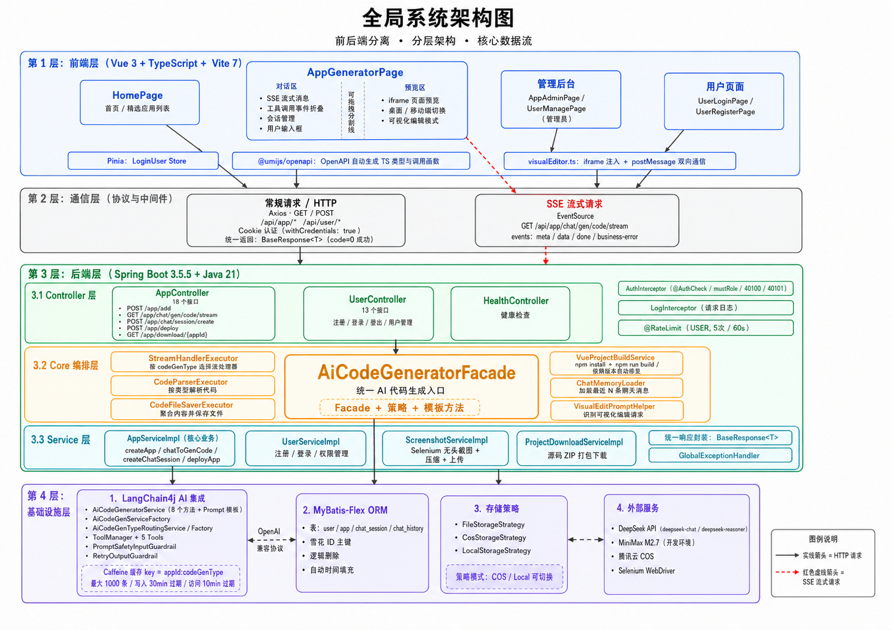
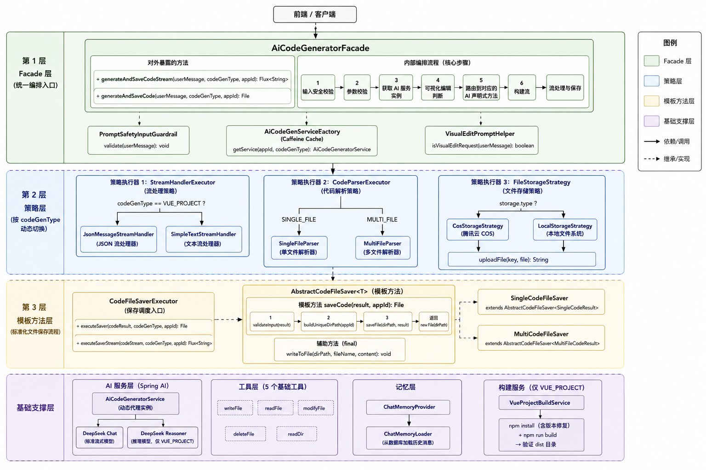
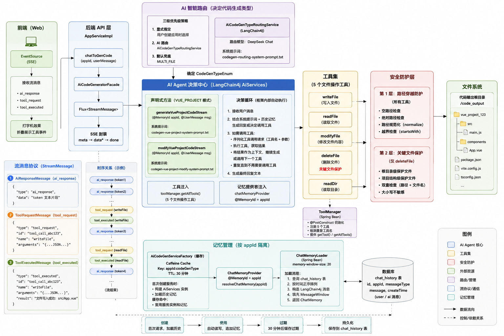

# AC AI Code Free — AI 智能编程辅助平台

基于 Spring Boot 3 + LangChain4j 的 AI 编程辅助平台，用户通过自然语言描述需求，AI 自动生成前端代码并实时预览。支持单文件/多文件/Vue 工程三种生成模式，具备流式对话、可视化编辑、一键部署能力，实现"需求描述→代码生成→实时预览→在线编辑→部署上线"全链路闭环。

## 技术栈

**后端**：Java 21 / Spring Boot 3.5.5 / MyBatis-Flex / LangChain4j 0.36.2 / Caffeine / Redis / Selenium / 腾讯云 COS

**前端**：Vue 3 / TypeScript / Vite 7 / Ant Design Vue / Pinia / Axios

**AI 模型**：DeepSeek Chat / DeepSeek Reasoner / MiniMax M2.7

**数据库**：MySQL 5.7+

---

## 系统架构

系统采用前后端分离架构，分为三层：

- **前端层**：Vue 3 + Ant Design Vue，通过 Axios 发送常规请求、EventSource 接收 SSE 流式响应，核心页面 AppGeneratorPage 集成对话区与 iframe 预览区
- **后端编排层**：Controller 处理请求与权限校验；Core 层通过 Facade 模式编排 AI 生成、流处理、代码解析、文件保存四个阶段；Service 层封装业务逻辑与数据持久化
- **基础设施层**：AI 集成基于 LangChain4j 声明式接口 + Caffeine 缓存工厂，按 `appId:codeGenType` 隔离服务实例与聊天记忆；ORM 层 MyBatis-Flex 操作 4 张业务表；存储层抽象为策略模式，支持本地存储与腾讯云 COS 切换

---

## AI 代码生成引擎架构

AI 代码生成引擎是平台核心，采用三层架构设计：

- **Facade 层**（`AiCodeGeneratorFacade`）：统一编排"获取 AI 服务→流式生成→流处理→代码解析→文件保存→构建部署"全流程，对 Controller 屏蔽内部复杂性
- **策略层**：按 codeGenType 动态切换处理逻辑
  - `StreamHandlerExecutor`：VUE_PROJECT → JsonMessageStreamHandler，SINGLE/MULTI_FILE → SimpleTextStreamHandler
  - `CodeParserExecutor`：单文件解析 vs 多文件解析
  - `FileStorageStrategy`：本地存储 vs 腾讯云 COS
- **模板方法层**（`AbstractCodeFileSaver`）：定义"验证→建目录→保存"标准流程，子类 SingleCodeFileSaver / MultiCodeFileSaver 仅实现差异化保存逻辑

AI 服务实例通过 `AiCodeGenServiceFactory` 动态构建，6 个声明式方法（3 种类型 × 生成/修改）配合 Caffeine 缓存（key=`appId:codeGenType`，写入 30min 过期）避免重复创建。

---

## AI 智能体架构

Vue 工程模式下 AI 作为智能体运行，具备自主工具调用能力：

- **工具集**：5 个文件操作工具，通过 `ToolManager` 统一注册管理，AI 根据任务自主决定调用顺序和参数
  - `readFile` / `writeFile` — 文件读写
  - `modifyFile` — 文件内容替换修改
  - `deleteFile` — 文件删除（受保护机制约束）
  - `readDir` — 目录结构浏览
- **安全防护**
  - **路径穿越防护**：所有工具通过 `resolveRelativePath()` 对 normalize 后路径校验，确保仍在项目根目录内
  - **关键文件保护**：`FileDeleteTool` 禁止删除 `package.json`、`vite.config.*`、`src/main.*` 等工程核心文件
- **流消息协议**：三种消息类型，前端可实时展示 AI 思考过程与工具调用事件
  - `ai_response` — AI 生成的 token 文本
  - `tool_request` — AI 发起的工具调用请求（含工具名与参数）
  - `tool_executed` — 工具执行结果
- **记忆管理**：基于 LangChain4j ChatMemory，按 `appId:codeGenType` 隔离，窗口大小 20 条

---

## 核心技术亮点

### 1. AI 代码生成引擎 — Facade + 策略 + 模板方法

- **Facade 统一编排**：`AiCodeGeneratorFacade` 封装"AI 生成→流处理→解析→保存→构建"全流程，Controller 仅需一行调用
- **策略动态切换**：`StreamHandlerExecutor` / `CodeParserExecutor` 按 codeGenType 选择处理器，新增生成类型只需添加策略实现
- **模板方法标准化**：`AbstractCodeFileSaver` 定义"验证→建目录→保存"骨架，子类仅实现差异化逻辑
- **缓存工厂**：`AiCodeGenServiceFactory` 按 `appId:codeGenType` 缓存 AI 服务实例（Caffeine，写入 30min 过期），6 个声明式方法动态构建

### 2. AI 智能体工具调用与安全防护

- **自主工具调用**：5 个文件操作工具通过 `ToolManager` 统一注册，AI 自主决定调用顺序与参数，完成 Vue 工程级代码生成
- **路径穿越防护**：所有工具对 normalize 后路径校验是否仍在项目根目录内
- **关键文件保护**：`FileDeleteTool` 禁止删除 `package.json`、`vite.config.*`、`src/main.*` 等工程核心文件
- **流消息协议**：`ai_response` / `tool_request` / `tool_executed` 三种消息类型，前端实时展示 AI 思考与工具调用过程

### 3. SSE 流式对话与实时预览

- **逐 token 推送**：后端 Reactor `Flux<ServerSentEvent>` + TokenStream，首字响应 < 1s
- **打字机渲染**：前端原生 EventSource 接收 SSE 流，实时渲染 AI 输出
- **流式聚合保存**：StringBuilder 在流结束后聚合完整内容，再解析代码块写入文件，确保文件完整性
- **自动构建**：Vue 工程模式流结束后触发 `npm install + npm run build`，支持依赖版本自动修复

### 4. iframe 注入式可视化编辑器

- **IIFE 脚本注入**：通过 `postMessage` 双向通信，实现元素悬浮高亮与点击选中
- **CSS 选择器自动生成**：标签+类+nth-of-type 组合，最多 8 层深度，选中元素信息自动拼接到 prompt
- **创建/修改分流**：自动判断消息是否含"选中元素+修改需求"，路由到差异化 AI 接口，增量修改替代全量重生成

### 5. AI 智能路由

- **三级优先级**：显式指定 > AI 路由分析 > 默认兜底（MULTI_FILE）
- **声明式路由接口**：`AiCodeGenTypeRoutingService` 自动分析用户 Prompt 判断应使用的代码生成类型

### 6. 全链路工程能力

- **自动封面图**：Selenium 无头浏览器截图 + 图片压缩 + COS 上传 + 异步回写
- **源码下载**：自动排除 `node_modules` / `dist` / `.env`，ZIP 压缩写入 HTTP 响应流
- **一键部署**：生成 6 位唯一 deployKey，复制 dist 到部署目录，静态资源映射即可访问
- **多模型配置**：标准任务 DeepSeek Chat，Vue 工程推理 DeepSeek Reasoner

---

## 许可证

[MIT](LICENSE)
