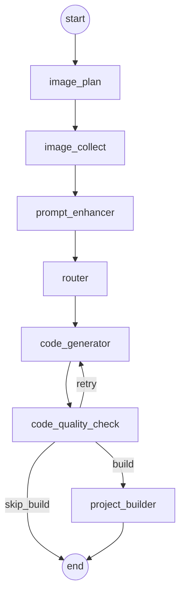

# Phase 10 AI 工作流 Implementation Plan

> **For Claude:** REQUIRED SUB-SKILL: Use superpowers:executing-plans to implement this plan task-by-task.

**Goal:** 在现有 `Spring Boot 3.5.5 + LangChain4j + Reactor SSE` 代码生成链路上，新增一套基于 `LangGraph4j` 的可编排 AI 工作流实现，完成图片收集、提示词增强、智能路由、代码生成、质量检查、可选构建与流式输出能力，并保持旧实现可继续使用。

**Architecture:** 新增独立的 `workflow` 模块，不直接破坏当前 `AiCodeGeneratorFacade -> AppServiceImpl -> AppController` 主链路；统一使用 `WorkflowContext` 保存阶段状态，使用 `MessagesState<String>` 承载 LangGraph4j 运行时状态，在“图片规划/图片收集 -> 提示词增强 -> 生成路由 -> 代码生成 -> 质量检查 -> 可选构建”的图结构上逐步演进，先落地线性版本，再落地并发优化版本，最后补充 SSE 与调试支持。

**Tech Stack:** Spring Boot 3.5.5, Java 21, LangChain4j 1.0.0-beta3, LangGraph4j 1.6.0-rc2, Reactor Flux, Hutool, MyBatis-Flex, Mermaid CLI, Pexels API, DashScope 文生图 API, 对象存储抽象（建议新增，避免把第三方存储 SDK 直接散落到工作节点中）

---

## 文档说明

这是一套完整的第 10 阶段开发计划。现在已经按你的要求合并为**单一文档**，不再拆分成多份文件，后续维护与查阅都以本文件为准。

本文件解决 5 个问题：

1. 第 10 阶段到底要做什么。
2. 为什么选 `LangGraph4j` 而不是低代码工作流平台。
3. 现有仓库应该怎么接入，不和旧逻辑打架。
4. 阶段边界和非目标是什么，避免一开始就把项目做散。
5. 后续执行应该按什么顺序推进，才能把风险压低。

## 规划依据

本计划基于 `docs/Projection/image/10/split/` 中的阶段素材，以及该目录下现有 OCR 汇总文本 `docs/Projection/image/10/ocr_phase10.txt` 整理而成。由于 OCR 个别代码片段存在识别噪音，本计划做了两类处理：

1. 保留教程中的关键技术路线和开发顺序。
2. 按当前仓库的真实结构改写落地方案，统一使用实际包名 `com.adcage.acaicodefree`，不直接照搬教程中的示例路径。

## 当前仓库的真实落点

当前后端代码生成主链路已经存在，关键位置如下：

1. `src/main/java/com/adcage/acaicodefree/controller/AppController.java`
2. `src/main/java/com/adcage/acaicodefree/service/impl/AppServiceImpl.java`
3. `src/main/java/com/adcage/acaicodefree/core/AiCodeGeneratorFacade.java`
4. `src/main/java/com/adcage/acaicodefree/ai/AiCodeGenServiceFactory.java`
5. `src/main/resources/prompt/codegen-single-file-system-prompt.txt`
6. `src/main/resources/prompt/codegen-multi-file-system-prompt.txt`

当前系统已经具备：

1. 对话式生成代码入口。
2. 基于 `CodeGenTypeEnum` 的单文件/多文件分支。
3. 流式输出能力。
4. 代码保存链路。
5. 会话与聊天历史落库。

当前系统暂时不具备：

1. 工作流编排层。
2. 图片素材规划与工具化收集。
3. 质量检查节点。
4. 工作流粒度的 SSE 事件模型。
5. LangGraph4j 调试支撑与并发节点模型。
6. 图片生成后的统一对象存储抽象。

第 10 阶段不是“再发明一个新的业务系统”，而是在不破坏现有业务主线的前提下，引入一套新的系统实现方式。

## 为什么选 LangGraph4j

### 备选方案 A：Dify / Coze / 百炼等低代码工作流平台

优点：

1. 上手快。
2. 可视化强。
3. 适合快速验证概念。
4. 非研发人员也能参与配置。

缺点：

1. 很难深度复用当前项目里的 Java Service、配置类、保存器、会话体系。
2. 复杂业务逻辑一旦超出平台预设能力，后续会被平台能力边界反向约束。
3. 图片收集、提示词增强、代码生成、质量检查、构建、流式输出这些步骤需要细粒度控制，低代码平台最终会把问题转化为平台适配问题。

### 备选方案 B：继续在 `Service` 层手写顺序流程

优点：

1. 初始改动最小。
2. 不需要新框架。

缺点：

1. 节点边界不清晰。
2. 分支逻辑、重试逻辑、条件跳转、并发、可视化都会越写越乱。
3. 未来如果要做子图、人审断点、恢复执行，`Service` 串行代码会快速恶化。

### 推荐方案：LangGraph4j

选择理由：

1. 它是 Java 生态内可直接落地的工作流框架，和当前栈最贴近。
2. 能直接复用 `LangChain4j`、`Spring Boot`、现有 Bean 与配置体系。
3. 可以逐步引入，而不是推倒重来。
4. 对条件边、并发、子图、流式事件、断点等能力有原生承载模型。
5. 从长期可维护性看，比低代码平台更适合这个仓库。

### 技术决策结论

1. 第 10 阶段采用 `LangGraph4j`。
2. 不新开一套完全独立的业务接口模型，优先复用 `AppController` / `AppServiceImpl` 现有能力。
3. 不移除旧代码生成链路，采用“新增工作流实现 + 可切换入口”的策略。

## 总体目标与非目标

### 阶段目标

1. 新增一套能够跑通的 LangGraph4j 线性工作流。
2. 让工作流能保存统一状态，而不是把数据散落在节点局部变量里。
3. 让工作流接入图片收集能力，解决网站全是占位图的问题。
4. 让工作流支持提示词增强，生成更贴近图片资源的页面描述。
5. 让工作流显式进行路由，而不是把所有决策都丢给模型临场发挥。
6. 让工作流能够接入现有代码生成与保存链路。
7. 新增质量检查节点，为后续循环修正或跳过构建提供基础。
8. 为工作流新增更细粒度的 SSE 输出能力。
9. 为图片收集场景准备并发优化方案，并明确何时用节点并发、何时只在节点内部并发。

### 非目标

1. 本阶段不要求把整个站点业务彻底重写为工作流风格。
2. 本阶段不要求前端页面全部重做。
3. 本阶段不要求一次性落地所有高级特性，比如断点、人审、Studio 全量接入。
4. 本阶段不强制新增 Vue 工程生成模式。当前仓库只有 `SINGLE_FILE` 与 `MULTI_FILE` 两种模式，构建分支可以先按“预留设计”处理。

## 推荐的实施顺序

第 10 阶段不应该一上来就做并发和子图，否则排障成本会被放大。正确顺序如下：

1. 先做工作流骨架，确认图结构、日志和状态更新都正常。
2. 再做 `WorkflowContext`、状态字段和假数据节点，确认上下文流转正确。
3. 再接入真实图片工具，但先允许结果以字符串形式参与提示词增强，优先把链路打通。
4. 再做图片规划模型与并发图片收集，把结果提升为结构化 `ImageResource`。
5. 再接入质量检查和条件边。
6. 最后补 Flux/SSE 输出、可视化、并发线程池与调试能力。

这条顺序的核心不是“慢慢来”，而是把高风险问题拆开：

1. 先验证框架接入。
2. 再验证状态模型。
3. 再验证外部 API。
4. 再验证并发。
5. 再验证流式输出。

## 总体架构图



在真正进入并发优化之后，`image_collect` 会进一步拆成：

1. `image_plan`
2. `content_image_collector`
3. `illustration_collector`
4. `diagram_collector`
5. `logo_collector`
6. `image_aggregator`

## 模块化落地决策

### 决策 1：新增独立 `workflow` 模块，而不是把 LangGraph4j 类散落到现有 `service` / `core`

推荐目录：

1. `src/main/java/com/adcage/acaicodefree/workflow/config`
2. `src/main/java/com/adcage/acaicodefree/workflow/state`
3. `src/main/java/com/adcage/acaicodefree/workflow/model`
4. `src/main/java/com/adcage/acaicodefree/workflow/ai`
5. `src/main/java/com/adcage/acaicodefree/workflow/tool`
6. `src/main/java/com/adcage/acaicodefree/workflow/node`
7. `src/main/java/com/adcage/acaicodefree/workflow/node/concurrent`
8. `src/main/java/com/adcage/acaicodefree/workflow/service`
9. `src/main/java/com/adcage/acaicodefree/workflow/controller`

原因：

1. 这样不会污染当前 `core` 的门面职责。
2. 以后如果工作流越做越大，模块边界依然清晰。
3. 节点、状态、工具、AI 服务、控制器天然属于同一个子域。

### 决策 2：旧链路保留，工作流链路新增开关控制

推荐增加配置：

1. `app.codegen.workflow.enabled=false`
2. `app.codegen.workflow.mode=legacy|workflow`

效果：

1. 默认不破坏线上行为。
2. 开发环境可以优先验证工作流实现。
3. 方便灰度迁移。

### 决策 3：状态不使用复杂 Reducer 建模，统一落到 `WorkflowContext`

原因：

1. 当前业务状态字段很多，直接把所有状态拆到 `Schema` 上会增大学习与维护成本。
2. 教程本身也强调，这类项目更适合自定义上下文对象。
3. `WorkflowContext` 更容易被普通 Spring Boot 工程师读懂。

### 决策 4：图片收集分两个里程碑落地

1. 基线版：AI 调工具收图，返回字符串摘要 `imageListStr`，先让增强提示词可用。
2. 优化版：AI 只负责规划 `ImageCollectionPlan`，图片工具并发执行，最终得到结构化 `List<ImageResource>`。

这样做的意义是：

1. 避免一开始就把“工具调用 + 结构化输出 + 并发 + 节点聚合”堆在一起。
2. 先交付可见价值，再做性能优化。

## 阶段性交付物

第 10 阶段建议至少产出以下可交付内容：

1. LangGraph4j 依赖与配置。
2. `WorkflowContext`、`ImageResource`、`QualityResult` 等状态模型。
3. 线性工作流版本。
4. 图片收集工具与 AI 服务。
5. 并发图片收集版本。
6. 质量检查节点与条件路由。
7. Flux / SSE 工作流接口。
8. 单元测试与必要的集成测试。
9. 给 AI 使用的提示词文件与开发提示词模板。
10. 运维与配置说明文档。

## 关键风险总览

1. `LangGraph4j` 版本不一致导致 API 行为变化。
2. `LangChain4j` 结构化输出与模型能力不匹配，导致 `POJO` 解析失败。
3. 图片生成与第三方图片 API 成本不可控。
4. Mermaid CLI 本地环境不一致，导致生成失败。
5. 图片 URL 时效性问题，尤其是 DashScope 结果 URL 只有短时有效。
6. 当前仓库已存在敏感配置习惯，必须把 API Key 从提交物中剥离。
7. 并发节点如果没有显式线程池配置，可能看起来是并发图，实际上仍然串行执行。

这些风险在下文的“技术细节”“执行任务与 AI 提示词”章节中继续展开。

## 技术细节

### 1. 依赖与版本决策

#### 1.1 当前仓库现状

当前 `pom.xml` 已经使用：

1. `Spring Boot 3.5.5`
2. `Java 21`
3. `LangChain4j 1.0.0-beta3`
4. `langchain4j-open-ai-spring-boot-starter 1.0.0-beta3`
5. `langchain4j-reactor 1.0.0-beta3`
6. `Hutool 5.8.38`

这说明第 10 阶段不需要重新搭 AI 基建，重点是补 `LangGraph4j` 与工作流子模块。

#### 1.2 新增依赖建议

必须新增：

```xml
<dependency>
    <groupId>org.bsc.langgraph4j</groupId>
    <artifactId>langgraph4j-core</artifactId>
    <version>1.6.0-rc2</version>
</dependency>
```

可选新增：

```xml
<dependency>
    <groupId>org.bsc.langgraph4j</groupId>
    <artifactId>langgraph4j-studio-springboot</artifactId>
    <version>1.6.0-rc2</version>
</dependency>
```

不建议一开始就加的依赖：

1. 各种对象存储 SDK 的多实现混用。
2. 额外的异步框架。
3. 为了工作流再引入第二套 AI 编排框架。

#### 1.3 版本注意事项

1. `LangGraph4j` 版本必须固定，不要随意升级到教程之外的版本。
2. 并发能力要以 `1.6.0-rc2` 或之后明确支持线程池的版本为基准。
3. 当前 `LangChain4j` 已处于 beta，`LangGraph4j` 也不成熟，双框架叠加时更需要锁版本。

### 2. 后端模块设计

#### 2.1 推荐目录结构

```text
src/main/java/com/adcage/acaicodefree/workflow/
├── ai/
│   ├── ImageCollectionService.java
│   ├── ImageCollectionServiceFactory.java
│   ├── ImageCollectionPlanService.java
│   ├── ImageCollectionPlanServiceFactory.java
│   ├── PromptEnhancerService.java
│   ├── PromptEnhancerServiceFactory.java
│   ├── QualityCheckService.java
│   └── QualityCheckServiceFactory.java
├── config/
│   ├── WorkflowProperties.java
│   ├── WorkflowThreadPoolConfig.java
│   └── LangGraphStudioConfig.java
├── controller/
│   └── WorkflowSseController.java
├── model/
│   ├── ImageCollectionPlan.java
│   ├── ImageResource.java
│   ├── ImageCategoryEnum.java
│   └── QualityResult.java
├── node/
│   ├── ImageCollectorNode.java
│   ├── PromptEnhancerNode.java
│   ├── RouterNode.java
│   ├── CodeGeneratorNode.java
│   ├── CodeQualityCheckNode.java
│   ├── ProjectBuilderNode.java
│   └── concurrent/
│       ├── ImagePlanNode.java
│       ├── ContentImageCollectorNode.java
│       ├── IllustrationCollectorNode.java
│       ├── DiagramCollectorNode.java
│       ├── LogoCollectorNode.java
│       └── ImageAggregatorNode.java
├── service/
│   ├── CodeGenWorkflow.java
│   ├── CodeGenConcurrentWorkflow.java
│   └── CodeGenSubgraphWorkflow.java
├── state/
│   ├── WorkflowContext.java
│   └── WorkflowStateSupport.java
└── tool/
    ├── ImageSearchTool.java
    ├── UndrawIllustrationTool.java
    ├── MermaidDiagramTool.java
    ├── LogoGeneratorTool.java
    ├── SpringContextUtil.java
    └── ObjectStorageManager.java
```

#### 2.2 为什么不继续堆进 `core`

因为 `core` 当前承担的是代码生成门面与解析/保存职责。把工作流节点、状态、工具、AI 服务都塞进去，最终会让 `core` 从“底层能力”变成“什么都放”。第 10 阶段最重要的工程决策之一，就是给工作流独立边界。

### 3. 状态模型设计

#### 3.1 核心决策

统一用 `WorkflowContext` 维护业务状态，LangGraph4j 的 `MessagesState<String>` 只负责作为容器承载上下文对象。

原因：

1. 当前工作流共享状态远超一两个字段。
2. 直接使用 `Schema + Reducer` 会让普通业务开发同学读代码吃力。
3. `WorkflowContext` 更容易序列化、打印日志、调试、单测断言。

#### 3.2 `WorkflowContext` 字段建议

首批基础字段：

1. `Long appId`
2. `String currentStep`
3. `String originalPrompt`
4. `String imageListStr`
5. `List<ImageResource> imageList`
6. `String enhancedPrompt`
7. `CodeGenTypeEnum generationType`
8. `String generatedCodeDir`
9. `String buildResultDir`
10. `QualityResult qualityResult`
11. `String errorMessage`

并发优化阶段新增：

1. `ImageCollectionPlan imageCollectionPlan`
2. `List<ImageResource> contentImages`
3. `List<ImageResource> illustrations`
4. `List<ImageResource> diagrams`
5. `List<ImageResource> logos`

#### 3.3 `ImageResource` 结构建议

字段：

1. `ImageCategoryEnum category`
2. `String description`
3. `String url`

枚举建议至少包含：

1. `CONTENT`
2. `ILLUSTRATION`
3. `ARCHITECTURE`
4. `LOGO`

#### 3.4 `QualityResult` 结构建议

字段：

1. `Boolean isValid`
2. `List<String> errors`
3. `List<String> suggestions`

说明：

1. `errors` 用来决定是否重试生成。
2. `suggestions` 用来保留改进建议，即便不触发重试也应输出给调用方。

### 4. 工作流节点职责

#### 4.1 线性版本节点

##### `ImageCollectorNode`

职责：

1. 基线版通过 AI 服务进行工具调用，得到图片说明字符串或结构化图片列表。
2. 更新 `imageListStr` 或 `imageList`。
3. 把 `currentStep` 更新为“图片收集”。

##### `PromptEnhancerNode`

职责：

1. 读取 `originalPrompt` 与图片信息。
2. 产出更具体的增强提示词。
3. 控制增强结果长度，不要把 90 多张图的 URL 全部塞进 prompt。

关键决策：

1. 只保留对生成真正有帮助的图片摘要。
2. URL 可以裁剪数量，描述优先于原始链接。

##### `RouterNode`

职责：

1. 结合 `originalPrompt`、`enhancedPrompt` 与应用配置决定生成类型。
2. 当前阶段优先复用现有 `CodeGenTypeEnum`，即 `SINGLE_FILE` 与 `MULTI_FILE`。

关键决策：

1. 不在第 10 阶段强行引入新的 `VUE_PROJECT` 枚举。
2. 如果未来要扩展为 `VUE_PROJECT`，单独开子阶段，不和本阶段绑定。

##### `CodeGeneratorNode`

职责：

1. 调用现有 `AiCodeGeneratorFacade`。
2. 统一复用现有保存能力。
3. 将结果目录写入 `generatedCodeDir`。

##### `CodeQualityCheckNode`

职责：

1. 对生成结果执行轻量质量检查。
2. 输出 `QualityResult`。
3. 为条件边提供路由依据。

建议实现顺序：

1. 先做规则型检查，如目录存在、核心文件存在、HTML/CSS/JS 文件数量、基础关键字检查。
2. 再考虑补充 AI 质量审查，用于输出建议，但不要一开始就把是否通过完全交给模型。

##### `ProjectBuilderNode`

职责：

1. 只在未来新增需要构建的模式时才真正生效。
2. 对当前仓库的 `SINGLE_FILE` / `MULTI_FILE` 先保留节点设计，不强制执行构建。

#### 4.2 并发版本节点

`ImagePlanNode` 负责规划，`ContentImageCollectorNode` / `IllustrationCollectorNode` / `DiagramCollectorNode` / `LogoCollectorNode` 负责执行，`ImageAggregatorNode` 负责汇总。

这套拆分是第 10 阶段并发优化的核心，因为它把“AI 决策”与“外部工具调用”拆开了：

1. AI 只负责生成收集计划。
2. 真实网络请求由工具并发完成。
3. 工作流层只负责编排与聚合。

### 5. 图片工具层设计

#### 5.1 `ImageSearchTool`

用途：Pexels 内容图片搜索。

决策：

1. 每次请求限制张数，建议默认 `12`。
2. 失败时返回空列表，不要抛出致命异常中断整条工作流。
3. `description` 优先取接口返回的语义字段，没有时退回搜索词。

#### 5.2 `UndrawIllustrationTool`

用途：unDraw 插画资源获取。

注意：

1. `unDraw` 并不是正式稳定开放 API，属于页面接口抓取方案。
2. 必须为该工具保留“接口结构可能变更”的降级预案。
3. 文档里要明确：它适合演示与低频使用，不适合作为唯一核心依赖。

#### 5.3 `MermaidDiagramTool`

用途：将 Mermaid 文本渲染为图片，再上传到对象存储。

关键决策：

1. 本地渲染优先，避免长 URL 在线生图方案。
2. 渲染后立即上传，再删除临时文件。
3. 调用终端命令前必须考虑 Windows 与非 Windows 的命令差异。

必须写进文档的注意事项：

1. Windows 下可能需要 `mmdc.cmd`。
2. `mermaid-cli` 需全局可执行或提供绝对路径配置。
3. 生成失败时要把命令输出记录到日志。

#### 5.4 `LogoGeneratorTool`

用途：基于 DashScope 文生图生成 Logo。

关键决策：

1. 一次只生成 1 张，控制成本。
2. 提示词中强制要求“不要包含文字”，否则 Logo 结果不稳定。
3. 生成结果需要二次转存到自有对象存储，因为原始 URL 可能短期失效。

### 6. AI 服务层设计

#### 6.1 `ImageCollectionService`

这是基线版的图片收集 AI 服务，职责是：

1. 接收用户网站需求。
2. 根据系统提示词自主选择工具。
3. 返回图片资源描述字符串，供提示词增强节点使用。

为什么基线版先返回 `String`：

1. 结构化输出与工具调用叠加时，各模型兼容性经常出问题。
2. 先打通工具调用闭环，比一开始追求 `List<ImageResource>` 更稳。

#### 6.2 `ImageCollectionPlanService`

这是优化版核心服务，职责是：

1. 不直接拿图片。
2. 只返回结构化收集计划 `ImageCollectionPlan`。
3. 让工具层可以并发执行。

关键决策：

1. 该服务只在模型明确支持 JSON/结构化输出时开启。
2. 如果线上模型能力不稳定，允许回退到基线版。

#### 6.3 `PromptEnhancerService`

职责：

1. 把用户意图和图片素材合成为更具体的生成提示词。
2. 控制提示词结构，避免信息堆砌。

建议输出内容：

1. 网站定位。
2. 页面风格约束。
3. 建议使用的图片类别和位置。
4. 必须展示的模块。
5. 对应的重点视觉资源。

#### 6.4 `QualityCheckService`

职责：

1. 对结果做规则检查。
2. 可选补充 AI 评审。
3. 返回 `QualityResult`。

推荐策略：规则优先，AI 辅助。

原因：

1. 规则检查稳定、便宜、可测试。
2. AI 建议更适合生成“建议”，不适合单独作为“通过/失败”裁判。

### 7. 配置设计

#### 7.1 建议新增的配置段

放在 `application.yml`：

```yaml
app:
  codegen:
    workflow:
      enabled: false
      mode: legacy
      max-image-count: 24
      image-summary-limit: 12
      enable-parallel-image-collect: false

workflow:
  mermaid:
    command: mmdc
    temp-dir: ${java.io.tmpdir}

  thread-pool:
    core-size: 10
    max-size: 20
    queue-capacity: 100
    thread-name-prefix: Parallel-Image-Collect-

pexels:
  api-key: ${PEXELS_API_KEY:}

dashscope:
  api-key: ${DASHSCOPE_API_KEY:}
  image-model: wanx2.2-t2i-flash

object-storage:
  endpoint: ${OBJECT_STORAGE_ENDPOINT:}
  access-key: ${OBJECT_STORAGE_ACCESS_KEY:}
  secret-key: ${OBJECT_STORAGE_SECRET_KEY:}
  bucket: ${OBJECT_STORAGE_BUCKET:}
```

#### 7.2 配置决策说明

1. 所有密钥一律走环境变量，不写死在 `application-local.yml`。
2. `workflow.enabled` 用于总开关。
3. `workflow.mode` 用于保留旧链路和新链路并存期的切换能力。
4. 图片数量上限必须可配置，否则 prompt 膨胀后会拖慢整个系统。

#### 7.3 必须写进计划的安全注意事项

1. 当前仓库本地配置中已经出现真实 API Key 风险，正式实现阶段必须先清理。
2. 计划文档和代码模板里只能写 `${ENV_VAR}` 占位符。
3. 任何截图、日志、单元测试输出都不得包含真实密钥。

### 8. 与现有业务整合策略

#### 8.1 最低成本整合点

整合优先从 `AppServiceImpl.chatToGenCode()` 入手，因为它已经串起了：

1. 权限校验。
2. 会话归属校验。
3. 历史消息保存。
4. 流式返回。

推荐改法：

1. 保留现有方法签名不变。
2. 在内部按配置决定走 `AiCodeGeneratorFacade` 旧链路还是 `CodeGenWorkflow` 新链路。
3. 工作流版本的最终输出仍然要落回现有聊天历史体系。

#### 8.2 `appId` 必须进入 `WorkflowContext`

原因：

1. 代码生成目录和保存都依赖应用 ID。
2. 后续如果要在节点内发 SSE、回写构建结果、更新数据库，都需要 `appId`。

#### 8.3 为什么不直接改 Controller 协议

因为 `AppController` 现有 SSE 契约已经在前端使用，阶段 10 更适合在后端内部换实现，而不是先改 API 形态。

### 9. 并发与子图决策

#### 9.1 三种方案取舍

##### 方案 1：节点内部 `CompletableFuture` 并发

优点：

1. 改动小。
2. 易于快速验证性能收益。
3. 对主工作流结构入侵最小。

缺点：

1. 并发逻辑藏在节点内部，可视化表达较弱。
2. 中间结果不够模块化。

##### 方案 2：LangGraph4j 并发分支

优点：

1. 节点职责更清晰。
2. 可视化与调试体验更好。
3. 状态聚合自然落在图结构里。

缺点：

1. 需要额外线程池配置。
2. 如果版本不对，会“看起来并发，实际串行”。

##### 方案 3：LangGraph4j 子图

优点：

1. 模块化最强。
2. 适合分团队协作和可复用子流程。

缺点：

1. 实现复杂度最高。
2. 目前这个项目的图片收集分支只有一个主动作，子图收益没有并发分支高。

#### 9.2 本阶段推荐结论

1. 第一优先：先做方案 1，快速验证价值。
2. 第二优先：正式版本落方案 2，作为主推实现。
3. 子图方案只保留文档示例，不列为本阶段必须交付。

### 10. Studio 与调试决策

结论：

1. Studio 可以写进计划，但不是阶段主路径。
2. 当前阶段真实调试主手段仍应是日志、单元测试、集成测试和 Mermaid 图输出。
3. 如果要接 Studio，只能作为附加能力，不能依赖它完成核心开发。

原因：

1. 教程中已明确指出 Studio 文档和接入体验不稳定。
2. 当前仓库有 `/api` 前缀，Studio 直连时容易出现地址不匹配问题。

### 11. SSE 设计决策

推荐顺序：

1. 先做 Flux 版，和当前 `AppController` 现有 Reactor 风格最一致。
2. `SseEmitter` 版保留为对照实现或调试方案。

建议事件：

1. `workflow_start`
2. `step_completed`
3. `workflow_completed`
4. `workflow_error`

可扩展事件：

1. `image_collect_progress`
2. `quality_check_result`
3. `code_generation_chunk`

### 12. 测试与验证原则

#### 12.1 测试分层

1. 纯模型类测试：`WorkflowContext`、`ImageCollectionPlan`、`QualityResult`
2. 工具类测试：Pexels、unDraw、Mermaid、Logo
3. 节点测试：每个节点只校验状态变更
4. 工作流测试：线性工作流、并发工作流
5. 控制器测试：SSE 接口、同步执行接口

#### 12.2 外部依赖测试策略

必须明确区分：

1. 可稳定离线运行的测试。
2. 依赖真实第三方 API 的集成测试。

建议：

1. 外部 API 测试默认不进入 CI 主流程。
2. 使用独立开关、环境变量或测试标签控制。
3. 单测中不要直接依赖真实外部响应结构，避免脆弱。

### 13. 实施注意事项清单

1. 不要把第 10 阶段理解成“新增一个业务模式”，它本质上是实现方式升级。
2. 不要在第一版就把所有高级特性全部上齐。
3. 不要把图片 URL 全量拼进增强提示词。
4. 不要默认相信结构化输出一定稳定，模型兼容性必须实测。
5. 不要在配置文件里提交真实密钥。
6. 不要在没有线程池配置时声称并发生效。
7. 不要把对象存储逻辑塞进工作节点本体，工具层必须封装。
8. 不要让 AI 质量检查直接决定一切，规则校验必须兜底。
9. 不要因为 Studio 不稳定就放弃 Mermaid 文本图输出，这仍然是最便宜的工作流可视化能力。
10. 不要忽略当前仓库的真实枚举与目录结构，计划必须以 `com.adcage.acaicodefree` 为准。

## 执行任务与 AI 提示词

本章节解决两件事：

1. 把第 10 阶段拆成可以执行的任务顺序。
2. 给 AI 提供足够具体、可复用的提示词模板，避免只得到空泛答案。

### 执行总原则

1. 先线性、后并发。
2. 先假数据节点、后真实业务节点。
3. 先保证状态流转正确，再追求图片收集质量与性能。
4. 先让旧链路和新链路并存，再考虑默认切换。
5. 先做 Flux SSE，再做 `SseEmitter` 对照实现。

### Task 1: 引入 LangGraph4j 依赖与最小 Demo

**Files:**
- Modify: `pom.xml`
- Create: `src/main/java/com/adcage/acaicodefree/workflow/service/SimpleWorkflowApp.java`
- Test: `src/test/java/com/adcage/acaicodefree/workflow/SimpleWorkflowAppTest.java`

**Step 1: 写失败测试**

验证点：项目能成功创建一个最小 `START -> node -> END` 工作流，并输出 Mermaid 图。

**Step 2: 引入最小依赖**

只加 `langgraph4j-core`，不要先加 Studio。

**Step 3: 写最小示例**

节点只输出日志与固定状态，不做任何真实业务。

**Step 4: 运行测试**

命令：

```bash
mvn test -Dtest=SimpleWorkflowAppTest
```

**Step 5: 验收标准**

1. 依赖可解析。
2. 工作流能编译。
3. Mermaid 文本可打印。

### Task 2: 定义 `WorkflowContext` 与基础状态模型

**Files:**
- Create: `src/main/java/com/adcage/acaicodefree/workflow/state/WorkflowContext.java`
- Create: `src/main/java/com/adcage/acaicodefree/workflow/model/ImageResource.java`
- Create: `src/main/java/com/adcage/acaicodefree/workflow/model/ImageCategoryEnum.java`
- Create: `src/main/java/com/adcage/acaicodefree/workflow/model/QualityResult.java`
- Test: `src/test/java/com/adcage/acaicodefree/workflow/state/WorkflowContextTest.java`

**Step 1: 先写状态读写测试**

验证从 `MessagesState<String>` 中读取和回写 `WorkflowContext` 是否正常。

**Step 2: 实现最小字段集**

先实现基础字段，不要一口气把并发字段全塞进去。

**Step 3: 补充静态辅助方法**

例如：

1. `getContext(state)`
2. `saveContext(context)`

**Step 4: 跑测试**

```bash
mvn test -Dtest=WorkflowContextTest
```

**Step 5: 验收标准**

1. `WorkflowContext` 可序列化。
2. 状态写回后下一节点能读到。
3. 日志打印时可读性良好。

### Task 3: 建立线性工作流骨架

**Files:**
- Create: `src/main/java/com/adcage/acaicodefree/workflow/node/ImageCollectorNode.java`
- Create: `src/main/java/com/adcage/acaicodefree/workflow/node/PromptEnhancerNode.java`
- Create: `src/main/java/com/adcage/acaicodefree/workflow/node/RouterNode.java`
- Create: `src/main/java/com/adcage/acaicodefree/workflow/node/CodeGeneratorNode.java`
- Create: `src/main/java/com/adcage/acaicodefree/workflow/node/CodeQualityCheckNode.java`
- Create: `src/main/java/com/adcage/acaicodefree/workflow/node/ProjectBuilderNode.java`
- Create: `src/main/java/com/adcage/acaicodefree/workflow/service/CodeGenWorkflow.java`
- Test: `src/test/java/com/adcage/acaicodefree/workflow/service/CodeGenWorkflowStructureTest.java`

**Step 1: 节点先用假数据**

每个节点只负责：

1. 记录当前步骤。
2. 模拟写入一个状态字段。

**Step 2: 工作流先串起来**

先不要接入真实图片、真实 AI、真实生成器。

**Step 3: 打印 Mermaid 图和步骤日志**

确保图结构可视、执行顺序正确。

**Step 4: 跑结构测试**

```bash
mvn test -Dtest=CodeGenWorkflowStructureTest
```

**Step 5: 验收标准**

1. 执行顺序正确。
2. 每一步都能看到状态变化。
3. 代码里没有真实业务耦合。

### Task 4: 接入图片工具层

**Files:**
- Create: `src/main/java/com/adcage/acaicodefree/workflow/tool/ImageSearchTool.java`
- Create: `src/main/java/com/adcage/acaicodefree/workflow/tool/UndrawIllustrationTool.java`
- Create: `src/main/java/com/adcage/acaicodefree/workflow/tool/MermaidDiagramTool.java`
- Create: `src/main/java/com/adcage/acaicodefree/workflow/tool/LogoGeneratorTool.java`
- Create: `src/main/java/com/adcage/acaicodefree/workflow/tool/ObjectStorageManager.java`
- Modify: `src/main/resources/application.yml`
- Modify: `src/main/resources/application-local.yml`
- Test: `src/test/java/com/adcage/acaicodefree/workflow/tool/*Test.java`

**Step 1: 先做图片搜索与插画工具**

因为它们的外部依赖成本最低。

**Step 2: 再做 Mermaid 渲染工具**

这里要把临时文件、命令执行、对象存储上传串起来。

**Step 3: 最后做 Logo 工具**

因为它最花钱，也最依赖外部模型稳定性。

**Step 4: 写测试时区分“本地集成测试”和“纯单测”**

不能把外部 API 全绑进默认 `mvn test`。

**Step 5: 验收标准**

1. 每个工具失败时都能优雅返回空结果。
2. 不出现密钥硬编码。
3. Mermaid 失败日志足够定位问题。

### Task 5: 接入基线版图片收集 AI 服务

**Files:**
- Create: `src/main/java/com/adcage/acaicodefree/workflow/ai/ImageCollectionService.java`
- Create: `src/main/java/com/adcage/acaicodefree/workflow/ai/ImageCollectionServiceFactory.java`
- Create: `src/main/resources/prompt/image-collection-system-prompt.txt`
- Modify: `src/main/java/com/adcage/acaicodefree/workflow/node/ImageCollectorNode.java`
- Test: `src/test/java/com/adcage/acaicodefree/workflow/ai/ImageCollectionServiceTest.java`

**Step 1: 先让 AI 能调用工具**

返回 `String` 即可，不先追求 `List<ImageResource>`。

**Step 2: 节点中只更新 `imageListStr`**

让链路先闭环。

**Step 3: 跑基线工作流测试**

看 `PromptEnhancerNode` 是否能读到图片文本。

**Step 4: 验收标准**

1. 能拿到图片说明文本。
2. 工作流不中断。
3. 模型工具调用失败时能安全降级。

### Task 6: 实现提示词增强与路由节点

**Files:**
- Create: `src/main/java/com/adcage/acaicodefree/workflow/ai/PromptEnhancerService.java`
- Create: `src/main/java/com/adcage/acaicodefree/workflow/ai/PromptEnhancerServiceFactory.java`
- Create: `src/main/resources/prompt/workflow-prompt-enhancer-system-prompt.txt`
- Modify: `src/main/java/com/adcage/acaicodefree/workflow/node/PromptEnhancerNode.java`
- Modify: `src/main/java/com/adcage/acaicodefree/workflow/node/RouterNode.java`
- Test: `src/test/java/com/adcage/acaicodefree/workflow/node/PromptEnhancerNodeTest.java`

**Step 1: 提示词增强服务先只做文案压缩与结构化拼装**

不要在这里重新做图片规划。

**Step 2: 路由节点优先复用现有枚举**

只输出 `SINGLE_FILE` / `MULTI_FILE`。

**Step 3: 验收标准**

1. 增强提示词比原始提示词更具体。
2. 结果长度可控。
3. 路由结果与当前仓库兼容。

### Task 7: 复用现有代码生成链路

**Files:**
- Modify: `src/main/java/com/adcage/acaicodefree/workflow/node/CodeGeneratorNode.java`
- Modify: `src/main/java/com/adcage/acaicodefree/workflow/state/WorkflowContext.java`
- Test: `src/test/java/com/adcage/acaicodefree/workflow/node/CodeGeneratorNodeTest.java`

**Step 1: 节点内调用 `AiCodeGeneratorFacade`**

不要复制代码保存逻辑。

**Step 2: 将 `generatedCodeDir` 写回上下文**

如果现有门面不返回足够信息，再补中间服务，不直接破坏现有门面接口语义。

**Step 3: 验收标准**

1. 能复用当前生成与保存能力。
2. 工作流链路和旧链路结果目录规则一致。

### Task 8: 实现质量检查节点与条件边

**Files:**
- Create: `src/main/java/com/adcage/acaicodefree/workflow/ai/QualityCheckService.java`
- Create: `src/main/java/com/adcage/acaicodefree/workflow/ai/QualityCheckServiceFactory.java`
- Create: `src/main/resources/prompt/code-quality-check-system-prompt.txt`
- Modify: `src/main/java/com/adcage/acaicodefree/workflow/node/CodeQualityCheckNode.java`
- Modify: `src/main/java/com/adcage/acaicodefree/workflow/service/CodeGenWorkflow.java`
- Test: `src/test/java/com/adcage/acaicodefree/workflow/node/CodeQualityCheckNodeTest.java`

**Step 1: 先做规则校验**

例如：

1. 目录存在。
2. 关键文件存在。
3. 单文件模式下至少有一个 `.html`。
4. 多文件模式下至少有 `index.html`、`style.css`、`script.js` 或等价核心文件。

**Step 2: AI 只补建议，不先决定一切**

**Step 3: 条件边逻辑**

当前仓库建议默认：

1. `isValid=false` 时回到 `code_generator`
2. `isValid=true` 时直接 `skip_build`

只有未来新增需要构建的模式时，再走 `project_builder`。

### Task 9: 在 `AppServiceImpl` 中接入工作流入口

**Files:**
- Create: `src/main/java/com/adcage/acaicodefree/workflow/config/WorkflowProperties.java`
- Modify: `src/main/java/com/adcage/acaicodefree/service/impl/AppServiceImpl.java`
- Modify: `src/main/resources/application.yml`
- Test: `src/test/java/com/adcage/acaicodefree/service/impl/AppServiceImplWorkflowTest.java`

**Step 1: 新增开关配置**

不要直接替换旧实现。

**Step 2: `chatToGenCode()` 内分支调用**

1. `legacy` 走原门面。
2. `workflow` 走 `CodeGenWorkflow`。

**Step 3: 仍然复用当前会话与历史消息逻辑**

这是低风险接入的关键。

### Task 10: 图片规划模型与节点内并发

**Files:**
- Create: `src/main/java/com/adcage/acaicodefree/workflow/model/ImageCollectionPlan.java`
- Create: `src/main/java/com/adcage/acaicodefree/workflow/ai/ImageCollectionPlanService.java`
- Create: `src/main/java/com/adcage/acaicodefree/workflow/ai/ImageCollectionPlanServiceFactory.java`
- Create: `src/main/resources/prompt/image-collection-plan-system-prompt.txt`
- Modify: `src/main/java/com/adcage/acaicodefree/workflow/node/ImageCollectorNode.java`
- Test: `src/test/java/com/adcage/acaicodefree/workflow/node/ImageCollectorNodeParallelTest.java`

**Step 1: 先让 AI 生成图片收集计划**

输出：

1. 内容图片任务
2. 插画任务
3. 架构图任务
4. Logo 任务

**Step 2: 节点内部使用 `CompletableFuture` 并发调用工具**

这是最小性能优化路径。

**Step 3: 把最终结果写入 `imageList`**

**Step 4: 验收标准**

1. 性能明显优于串行版本。
2. 并发失败不会导致整个节点全部崩溃。

### Task 11: 实现 LangGraph4j 并发工作流版本

**Files:**
- Create: `src/main/java/com/adcage/acaicodefree/workflow/node/concurrent/ImagePlanNode.java`
- Create: `src/main/java/com/adcage/acaicodefree/workflow/node/concurrent/ContentImageCollectorNode.java`
- Create: `src/main/java/com/adcage/acaicodefree/workflow/node/concurrent/IllustrationCollectorNode.java`
- Create: `src/main/java/com/adcage/acaicodefree/workflow/node/concurrent/DiagramCollectorNode.java`
- Create: `src/main/java/com/adcage/acaicodefree/workflow/node/concurrent/LogoCollectorNode.java`
- Create: `src/main/java/com/adcage/acaicodefree/workflow/node/concurrent/ImageAggregatorNode.java`
- Create: `src/main/java/com/adcage/acaicodefree/workflow/config/WorkflowThreadPoolConfig.java`
- Create: `src/main/java/com/adcage/acaicodefree/workflow/service/CodeGenConcurrentWorkflow.java`
- Test: `src/test/java/com/adcage/acaicodefree/workflow/service/CodeGenConcurrentWorkflowTest.java`

**Step 1: 每个并发节点只负责一种图片类型**

**Step 2: `ImageAggregatorNode` 只做聚合，不再做规划**

**Step 3: 显式配置线程池与 `RunnableConfig`**

不然并发不会真正生效。

**Step 4: 验收标准**

1. 日志线程名能体现并发执行。
2. 聚合节点只在全部分支完成后触发。

### Task 12: 实现 Flux SSE 输出

**Files:**
- Modify: `src/main/java/com/adcage/acaicodefree/workflow/service/CodeGenWorkflow.java`
- Create: `src/main/java/com/adcage/acaicodefree/workflow/controller/WorkflowSseController.java`
- Test: `src/test/java/com/adcage/acaicodefree/workflow/controller/WorkflowSseControllerTest.java`

**Step 1: 工作流服务新增 `executeWorkflowWithFlux()`**

**Step 2: 固定事件名**

1. `workflow_start`
2. `step_completed`
3. `workflow_completed`
4. `workflow_error`

**Step 3: 只推送工作流关键阶段，不要一开始就推过细事件**

**Step 4: 验收标准**

1. 浏览器可收到标准 SSE 数据流。
2. 出错时会发送错误事件并关闭连接。

### Task 13: 可选实现 `SseEmitter` 对照版本与 Demo 页面

**Files:**
- Modify: `src/main/java/com/adcage/acaicodefree/workflow/service/CodeGenWorkflow.java`
- Modify: `src/main/java/com/adcage/acaicodefree/workflow/controller/WorkflowSseController.java`
- Create: `docs/plans/assets/phase10-workflow-sse-demo.html`

**说明：**

这个任务不是主路径，只用于对照学习和快速演示。

### 推荐测试命令

按阶段执行，不要每改一个文件就全量跑一次：

```bash
mvn test -Dtest=SimpleWorkflowAppTest
mvn test -Dtest=WorkflowContextTest
mvn test -Dtest=CodeGenWorkflowStructureTest
mvn test -Dtest=ImageCollectionServiceTest
mvn test -Dtest=CodeGenConcurrentWorkflowTest
mvn test
mvn clean package
```

### 给 AI 的高质量提示词模板

以下提示词不是“让 AI 一次性把整期项目写完”，而是为了让 AI 在每个阶段都只解决一个明确问题。

#### Prompt 1：生成工作流骨架

```text
你现在是资深 Java 后端工程师，请基于 Spring Boot 3.5.5、Java 21、LangChain4j 1.0.0-beta3、LangGraph4j 1.6.0-rc2，帮我在包路径 `com.adcage.acaicodefree.workflow` 下生成一个最小可运行的 LangGraph4j 工作流示例。

要求：
1. 只生成骨架，不接入真实业务。
2. 工作流节点为 `image_collector -> prompt_enhancer -> router -> code_generator -> code_quality_check -> project_builder`。
3. 使用 `MessagesState<String>` 作为状态容器。
4. 每个节点只打印日志并返回一个最小状态更新。
5. 输出 Mermaid 图内容。
6. 代码风格贴近 Spring Boot 项目，不要使用教程里其他仓库的包名。
7. 不要生成前端代码。

请直接输出：
1. 需要创建的文件列表
2. 每个文件的完整 Java 代码
3. 对应测试类代码
```

#### Prompt 2：生成 `WorkflowContext`

```text
请在 `com.adcage.acaicodefree.workflow.state` 下设计一个 `WorkflowContext`，用于承载 LangGraph4j 工作流中的共享状态。

要求：
1. 必须可序列化。
2. 提供从 `MessagesState<String>` 读取和保存上下文的静态方法。
3. 字段包含：appId、currentStep、originalPrompt、imageListStr、imageList、enhancedPrompt、generationType、generatedCodeDir、buildResultDir、qualityResult、errorMessage。
4. 不要直接使用 LangGraph4j 的复杂 Reducer 机制管理业务字段。
5. 给出完整代码和测试代码。
```

#### Prompt 3：生成图片收集工具

```text
请为 Spring Boot 项目生成 4 个图片工具类，放在 `com.adcage.acaicodefree.workflow.tool` 包下：
1. `ImageSearchTool`：调用 Pexels API 搜索内容图片
2. `UndrawIllustrationTool`：从 unDraw 获取插画
3. `MermaidDiagramTool`：将 Mermaid 文本渲染为 SVG 并上传对象存储
4. `LogoGeneratorTool`：调用 DashScope 文生图生成 Logo

要求：
1. 返回统一的 `List<ImageResource>`。
2. 失败时返回空列表，不要直接中断整个工作流。
3. 配置项用 Spring `@Value` 或 `@ConfigurationProperties` 读取，不能写死密钥。
4. Mermaid 工具必须考虑 Windows 下 `mmdc.cmd` 的兼容。
5. 生成对应测试类，但涉及真实第三方调用的测试要注明需要环境变量。
```

#### Prompt 4：生成图片规划服务

```text
请基于 LangChain4j 为我生成一个 `ImageCollectionPlanService`，用于根据用户的网站需求输出结构化图片收集计划 `ImageCollectionPlan`。

要求：
1. 放在 `com.adcage.acaicodefree.workflow.ai`。
2. 使用独立的系统提示词文件 `src/main/resources/prompt/image-collection-plan-system-prompt.txt`。
3. `ImageCollectionPlan` 包含 4 类任务：contentImageTasks、illustrationTasks、diagramTasks、logoTasks。
4. 每种任务请使用 Java `record` 或简洁的数据结构表示。
5. 输出完整的接口、工厂、模型类、提示词文件内容。
6. 说明如果模型结构化输出不稳定，应该如何回退到字符串方案。
```

#### Prompt 5：生成并发图片收集节点

```text
请帮我在 `com.adcage.acaicodefree.workflow.node.concurrent` 下生成一组 LangGraph4j 节点，用于并发图片收集：
1. ImagePlanNode
2. ContentImageCollectorNode
3. IllustrationCollectorNode
4. DiagramCollectorNode
5. LogoCollectorNode
6. ImageAggregatorNode

要求：
1. 每个节点只处理一种职责。
2. 从 `WorkflowContext` 读取和写回状态。
3. 聚合节点只负责汇总，不再做图片规划。
4. 给出一个 `CodeGenConcurrentWorkflow` 示例，展示如何在图中连接这些并发分支。
5. 额外给出线程池和 `RunnableConfig` 的配置代码，确保并发生效。
```

#### Prompt 6：生成质量检查节点

```text
请为 Spring Boot + LangGraph4j 项目生成 `CodeQualityCheckNode` 和 `QualityCheckService`。

要求：
1. 规则检查优先，AI 建议作为补充。
2. 输出 `QualityResult`，包含 `isValid`、`errors`、`suggestions`。
3. 规则至少检查：生成目录是否存在、关键文件是否存在、文件数量是否合理。
4. 给出如何在 LangGraph4j 中通过条件边实现 `fail -> code_generator` 与 `skip_build -> end` 的路由示例。
5. 不要默认依赖 Vue 构建模式，因为当前仓库只有单文件和多文件模式。
```

#### Prompt 7：生成 Flux SSE 版本工作流接口

```text
请基于 Reactor Flux 为我生成 LangGraph4j 工作流的流式输出实现。

要求：
1. 在 `CodeGenWorkflow` 中新增 `executeWorkflowWithFlux(String originalPrompt, Long appId)` 方法。
2. 新增 `WorkflowSseController`，提供 `GET /workflow/execute-flux` 接口。
3. 输出的 SSE 事件名包含：workflow_start、step_completed、workflow_completed、workflow_error。
4. 每一步都从 `WorkflowContext` 读取 `currentStep` 返回给前端。
5. 出错时必须推送错误事件，再结束连接。
6. 请同时输出一个简单 HTML Demo 页面，仅用于测试 SSE，不需要写正式前端业务代码。
```

#### Prompt 8：排查结构化输出兼容性问题

```text
我在 LangChain4j + OpenAI 兼容模型上遇到了“结构化输出 + 工具调用”冲突，请帮我从工程角度分析问题并给出降级策略。

上下文：
1. 当前项目是 Spring Boot + LangChain4j + LangGraph4j。
2. 我希望 AI 一边调用图片工具，一边返回 `List<ImageResource>` 或 `ImageCollectionPlan`。
3. 某些模型会把工具调用参数错误解析成结构化返回值。

请输出：
1. 问题根因分析
2. 哪些能力可以并存，哪些最好拆开
3. 一条最稳妥的降级路径
4. 代码接口层面的改造建议
```

### 最终验收清单

1. `legacy` 与 `workflow` 两条代码生成链路可以并存。
2. 线性工作流能稳定跑通。
3. 图片收集至少支持内容图、插画、架构图、Logo 四类来源。
4. 增强提示词能消化图片信息而不是无脑堆 URL。
5. 代码生成节点真正复用了现有门面能力。
6. 质量检查节点可以产生明确的结构化结果。
7. Flux SSE 可以持续推送工作流阶段事件。
8. 并发图片收集版本可以看到真实并发生效。
9. 所有密钥都已切换为环境变量，不留明文。
10. 关键测试命令可以执行，且结果可复现。
